************************************************
Utilisation du système de gestion des conditions
************************************************

Introduction
============

Le module de dépôt de conformité aux conditions du système de
signalement d’événement (SSEL) est un outil efficace qui permet aux
sociétés de déposer des documents exigés pour se conformer à des
conditions auprès de la Régie de l’énergie du Canada. Le SSEL permet
également aux sociétés de faire le suivi de l’état d’avancement de leurs
projets approuvés, notamment en ce qui a trait aux instruments de
réglementation, aux conditions, aux composants, aux tâches et aux
mesures à prendre.

Le présent manuel renferme des instructions détaillées pour aider les
utilisateurs à accéder au SSEL et à téléverser de nouveaux documents de
conformité et de nouvelles dates pour les jalons d’un projet (les
captures d’écran ci-dessous sont des exemples qui ne sont fournis qu’aux
fins de démonstration). Pour un complément d’information sur les
exigences en matière de conformité aux conditions, veuillez consulter la
page `Conformité et
exécution <https://www.rec-cer.gc.ca/fr/securite-environnement/conformite-execution/index.html>`__
du site Web de la Régie.

*Avertissement :* Les sociétés réglementées peuvent communiquer avec la
Régie dans la langue officielle de leur choix. Certains renseignements
peuvent donc ne figurer que dans une seule langue officielle dans le
SSEL. Si vous avez des questions ou des préoccupations, veuillez
communiquer avec le gestionnaire de projet aux opérations.

Communiquez avec nous
=====================

Pour toute question ou tout problème d’ordre technique concernant le
SSEL, veuillez communiquer avec :

Régie de l’énergie du Canada

Soutien au SSEL

dlerssupport@cer-rec.gc.ca

1-800-899-1265

Glossaire
=========

+----------------+-----------------------------------------------------+
| Avis           | Une demande (lettre d’accompagnement seulement)     |
|                | visant à faire approuver le traitement confidentiel |
|                | de tout renseignement susceptible d’être divulgué.  |
|                | Pour en savoir plus sur le dépôt de documents       |
|                | confidentiels et les exigences relatives à la       |
|                | lettre d’accompagnement, consultez la section 1.5   |
|                | du `Guide de                                        |
|                | dépôt <https://www.cer-                             |
|                | rec.gc.ca/fr/demandes-audiences/deposer-demande-doc |
|                | uments/guides-depot/guide-depot/guide-depot.pdf>`__ |
|                | de la Régie.                                        |
+================+=====================================================+
| Composant      | Sous-élément d’une condition – par ex.,             |
|                | a), b), i), ii).                                    |
|                |                                                     |
|                | Les composants ne s’appliquent qu’aux conditions.   |
+----------------+-----------------------------------------------------+
| Condition      | Exigences d’un instrument de réglementation qu’une  |
|                | société doit respecter pour être autorisée à        |
|                | construire un projet, à l’exploiter et/ou à cesser  |
|                | de l’exploiter.                                     |
+----------------+-----------------------------------------------------+
| Dépôt          | Documents, y compris les avis, qu’une société doit  |
|                | fournir pour satisfaire à une condition et/ou à une |
|                | mesure à prendre.                                   |
+----------------+-----------------------------------------------------+
| DR             | Demande de renseignements                           |
+----------------+-----------------------------------------------------+
| Gestionnaire   | Gestionnaire de projet aux opérations               |
| de projet aux  |                                                     |
| opérations     |                                                     |
+----------------+-----------------------------------------------------+
| Instrument de  | Document autorisant un projet ou une activité qui   |
| réglementation | peut exposer les exigences auxquelles une société   |
|                | doit se conformer (par ex., ordonnance de la        |
|                | Commission, certificat, permis, ordonnance de       |
|                | sécurité, etc.).                                    |
+----------------+-----------------------------------------------------+
| Jalon          | Événement (p. ex., début de la construction) qui    |
|                | déclenchera des dépôts.                             |
|                |                                                     |
|                | On s’attend à ce que les sociétés soumettent les    |
|                | dates des jalons à l’égard des principaux           |
|                | événements qui déclencheront le dépôt de documents. |
+----------------+-----------------------------------------------------+
| Mesure à       | Sous-élément d’une tâche – par ex., demande de      |
| prendre        | renseignements 1.1, demande de renseignements 1.2.  |
|                |                                                     |
|                | Les mesures à prendre ne s’appliquent qu’aux        |
|                | tâches.                                             |
+----------------+-----------------------------------------------------+
| Projet         | Engagement de construire, d’exploiter et/ou de      |
|                | cesser d’exploiter une installation sous            |
|                | réglementation fédérale pour laquelle une société a |
|                | présenté une demande à la Commission de la Régie de |
|                | l’énergie du Canada et en a obtenu l’autorisation.  |
+----------------+-----------------------------------------------------+
| REGDOCS        | REGDOCS est une base de données                     |
|                | (https://apps.rec-cer.gc.ca/REGDOCS/Accueil/Index/) |
|                | sur les activités de réglementation et opérations   |
|                | réglementaires menées par la Régie.                 |
+----------------+-----------------------------------------------------+
| Régie          | Régie de l’énergie du Canada                        |
+----------------+-----------------------------------------------------+
| SSEL           | Système de signalement d’événement en ligne         |
+----------------+-----------------------------------------------------+
| Tâche          | Exigence supplémentaire à laquelle une société doit |
|                | se conformer (p. ex., réponses officielles et non   |
|                | officielles à des DR, demandes de modification [p.  |
|                | ex., demandes de mesures ou mises à jour d’un       |
|                | projet], demandes d’autorisation de mise en         |
|                | service, etc.).                                     |
+----------------+-----------------------------------------------------+

Démarrage
=========

Peu après la publication d’un instrument de réglementation approuvant un
projet, un courriel renfermant un hyperlien vers le SSEL est envoyé aux
personnes-ressources de la société.

Pour consulter l’information sur le projet et déposer des documents,
accédez au SSEL à l’aide de cet hyperlien.

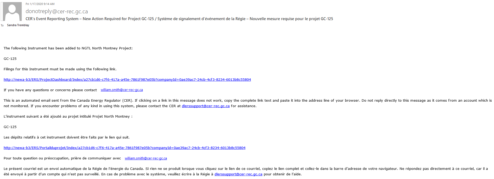

Navigation dans le SSEL
=======================

Menu principal
--------------

Dans le SSEL, le **menu principal** se trouve du côté gauche de l’écran.
Il renferme des liens rapides permettant d’accéder aux précisions sur le
projet, de déposer des documents, de consulter les dépôts récents, de
consulter les documents obligatoires et de consulter ou de mettre à jour
les dates associées aux jalons. Il permet aussi d’accéder au Guide
d’utilisation.

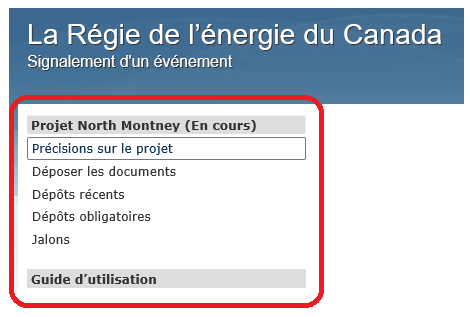

Vous trouverez ci-dessous une description de chacun des liens qui se
trouvent dans le menu principal.

Précisions sur le projet
------------------------

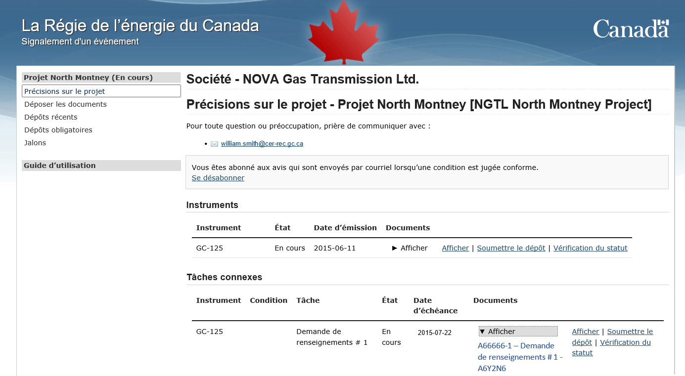

La page **Précisions sur le projet** renferme les renseignements
suivants :

Coordonnées du gestionnaire de projet aux opérations
~~~~~~~~~~~~~~~~~~~~~~~~~~~~~~~~~~~~~~~~~~~~~~~~~~~~

L’adresse de courriel indiquée sur cette page est celle de la
personne-ressource de la Régie pour toute question ou préoccupation
concernant le projet.

Notification par courriel
~~~~~~~~~~~~~~~~~~~~~~~~~

Cliquez sur « S’abonner / Se désabonner » pour recevoir ou cesser de
recevoir des avis par courriel de la Régie lorsque l’état d’une
condition ou d’une mesure à prendre est jugé conforme.

Instruments et tâches connexes
~~~~~~~~~~~~~~~~~~~~~~~~~~~~~~

**►Afficher**

Consultez les documents liés à un instrument ou à une tâche pour le
projet en cliquant sur le bouton « ►\ **Afficher** » (lorsqu’aucun
document n’est disponible, rien ne s’affiche).

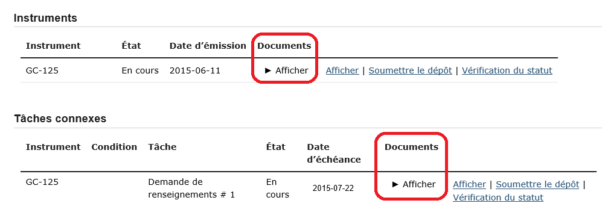

**Afficher**

Pour consulter les instruments de réglementation ou les tâches liés au
projet, cliquez sur le lien « **Afficher** » en bleu. Une liste de
toutes les conditions associées à cet instrument ou de toutes les
mesures à prendre pour cette tâche s’affichera.

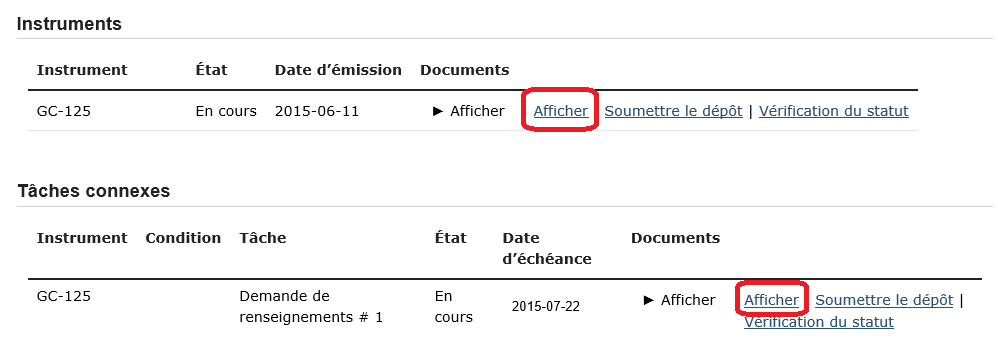

Une fois sur la page de l’instrument ou de la tâche, faites glisser le
curseur de la souris sur un élément précis pour afficher des
renseignements détaillés et accéder au bouton « Soumettre le dépôt »
pour celui-ci (si un dépôt est requis).

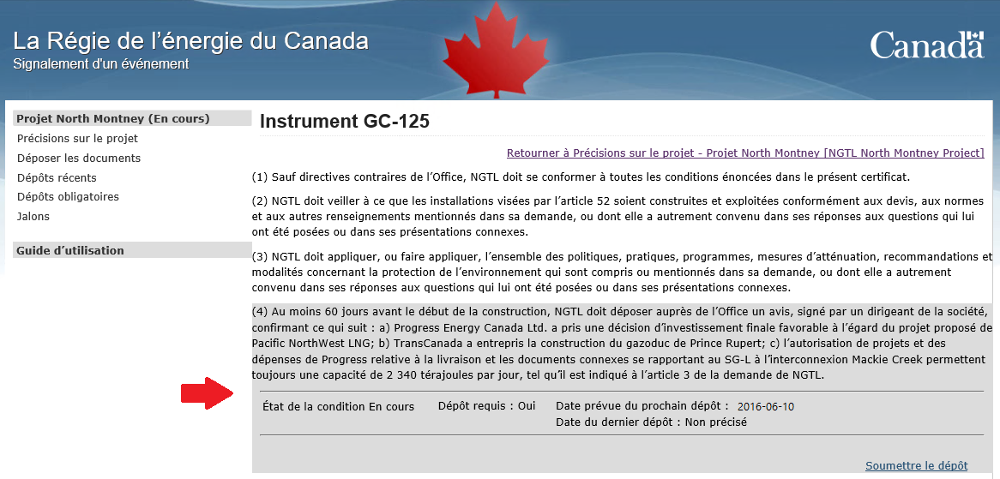

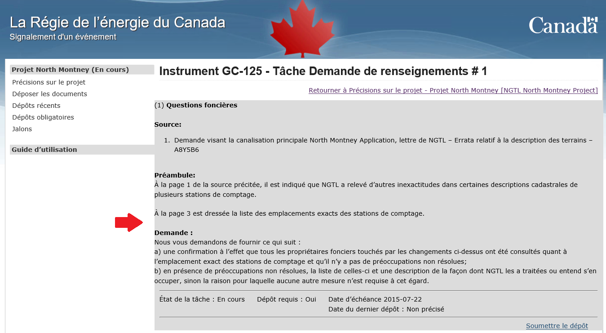

**
**

**Soumettre le dépôt**

Pour déposer des documents relatifs à des instruments de réglementation
ou à des tâches liés au projet, cliquez sur le lien « **Soumettre le
dépôt** » en bleu. Il est également possible d’accéder à la page
« Soumettre le dépôt » à partir du menu principal.

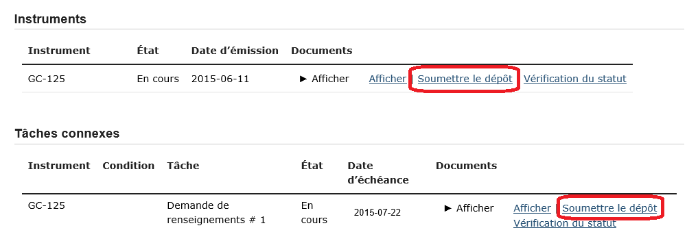

**Vérification du statut**

Consultez le statut des instruments de réglementation ou des tâches pour
le projet (y compris le statut des conditions et des mesures à prendre)
en cliquant sur le lien « **Vérification du statut** » en bleu.

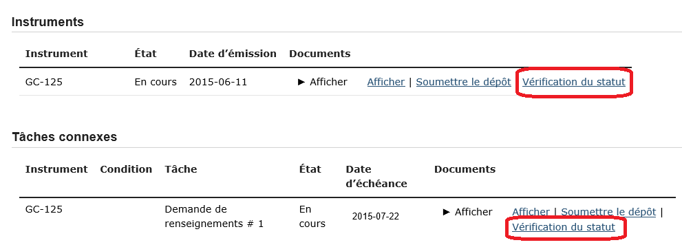

Les colonnes « État de la condition », « État de la tâche » et « Statut
du document » afficheront l’état actuel de l’examen (en cours ou
conforme) et le statut du document (aucun dépôt requis, en examen,
satisfaisant, etc.). Lorsqu’une condition comporte des composants (p.
ex., la condition 15 ci-dessous), l’état de chacun est affiché.

Remarque – La colonne « État de la condition » d’une condition qui
comporte des composants n’affichera la mention « Conforme » que lorsque
**tous** les composants auront été jugés satisfaisants.

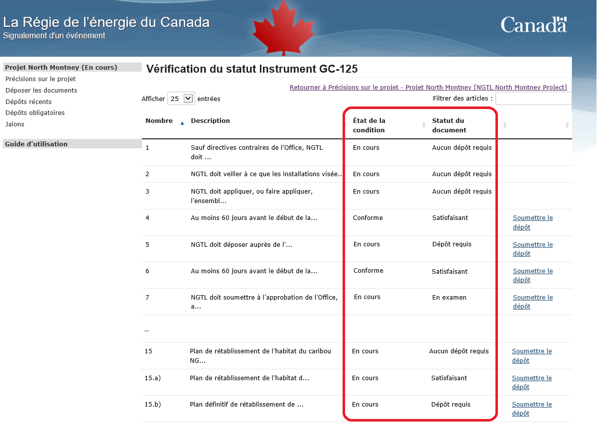

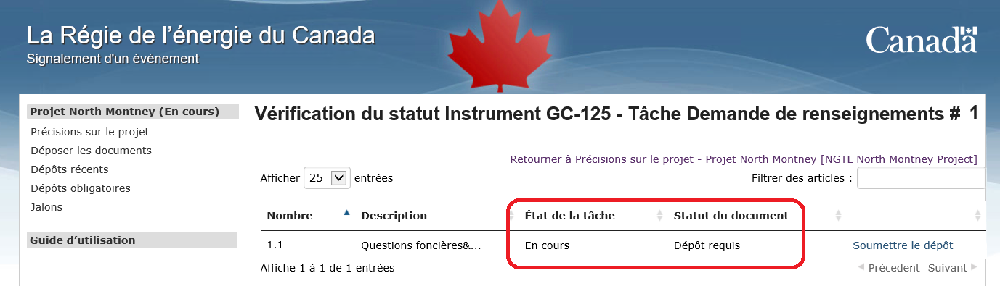

Dépôts récents
--------------

La page « **Dépôts récents** » énumère les documents déposés récemment
pour le projet. Ceux-ci peuvent être consultés ou rétractés à partir de
cette page.

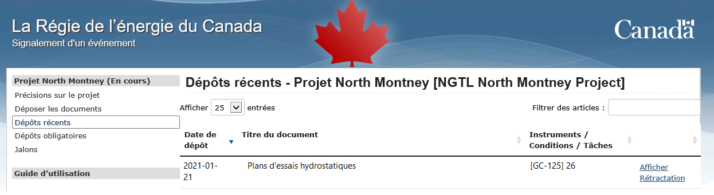

Dépôts obligatoires
-------------------

La page « **Dépôts obligatoires** » énumère les dépôts requis pour le
projet.

La date de dépôt prévue est calculée automatiquement en fonction des
dates associées aux jalons (voir la section `Jalons <#jalons>`__
ci-dessous).

Les utilisateurs peuvent déposer des documents à partir de cet écran en
cliquant sur le lien « **Soumettre le dépôt** » en bleu, à côté de
l’élément pertinent (voir la section `Dépôt de
documents <#dépôt-de-documents>`__).

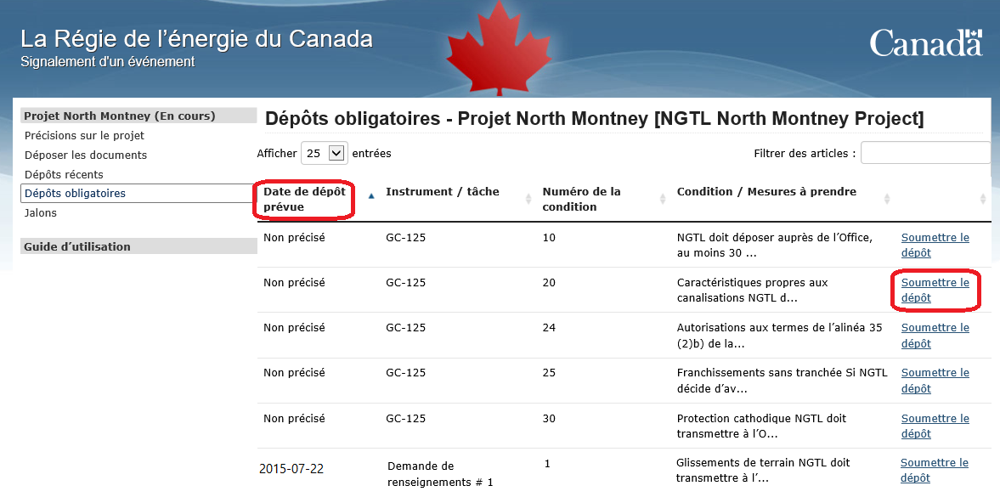

Jalons
------

Les jalons sont fondés sur ce qui suit :

-  L’information fournie par la société dans sa demande;

-  Le calendrier de construction;

-  Les exigences réglementaires.

Exemples :

-  Début de la construction;

-  Mise en exploitation;

-  Demande d’autorisation de mise en service.

On s’attend à ce que les sociétés soumettent les dates associées aux
jalons pour les principaux événements qui déclencheront le dépôt de
documents.

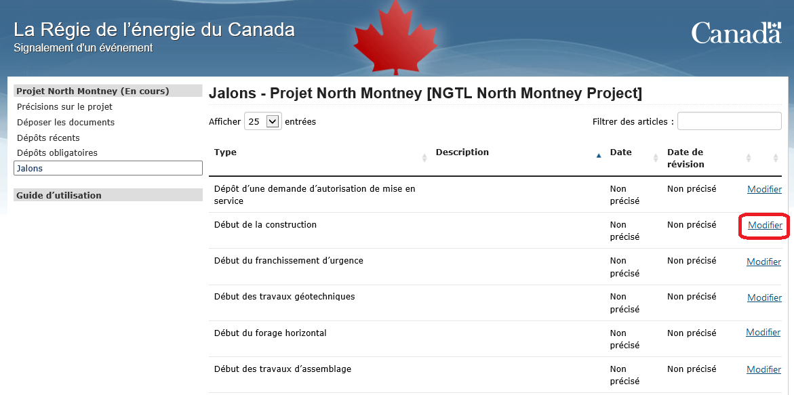

Mode d’emploi
=============

Dépôt de documents
------------------

Cliquez sur « **Déposer les documents **\ » dans le **menu principal**
(ou à partir de n’importe quelle page où s’affiche ce lien).

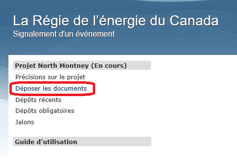

Étape 1 – Entente sur la protection des renseignements personnels

Confirmez que vous avez lu et compris l’information contenue dans
l’Entente sur la protection des renseignements personnels en cochant
« **J’ai lu et compris l’information ci-dessus** ».

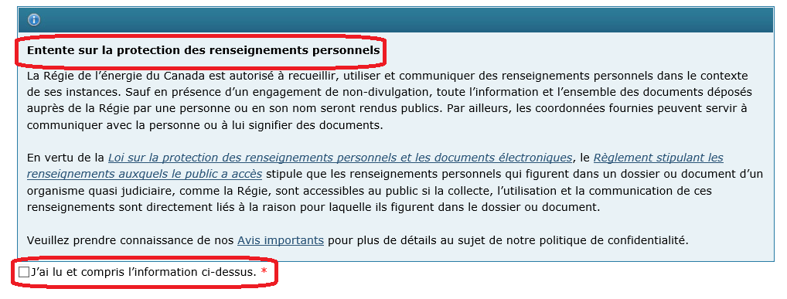

Étape 2 – Coordonnées du déposant

Entrez vos coordonnées dans la section « **Coordonnées du déposant »**
(les champs marqués d’un astérisque rouge sont obligatoires).

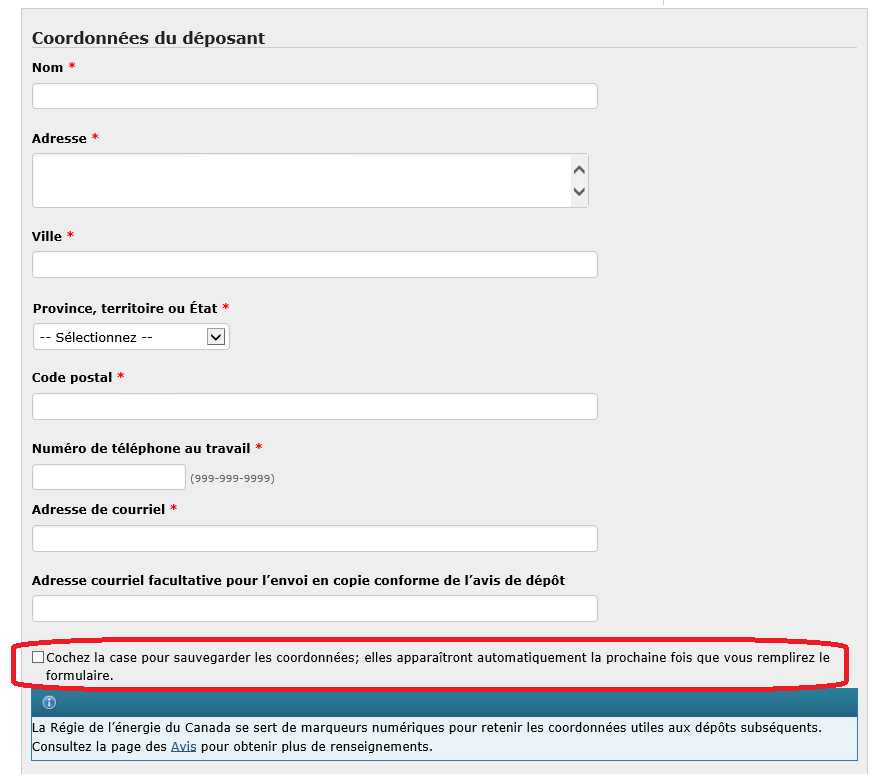

Dans le champ « **Adresse de courriel facultative pour l’envoi en copie
conforme de l’avis de dépôt** », insérez l’adresse de courriel de toute
autre partie à qui une copie du document doit être envoyée. Les adresses
de courriel doivent être séparées par une virgule ou un point-virgule
suivi d’un espace.

Exemples :

karen.hilltop@abccompany.ca, mark.johnston@abccompany.ca

karen.hilltop@abccompany.ca; mark.johnston@abccompany.ca

Cochez la case « **Cochez la case pour sauvegarder les coordonnées;
elles apparaîtront automatiquement la prochaine fois que vous remplirez
le formulaire** » pour enregistrer les coordonnées du déposant pour le
dépôt actuel et les dépôts subséquents.

Étape 3 – Dépôt / Avis

Selon la nature de la documentation soumise, sélectionnez « **Dépôt** »
ou « **Avis** ».

Sélectionnez « **Dépôt** » si vous téléversez un dépôt directement dans
le SSEL.

Sélectionnez « **Avis** » si vous téléchargez une demande (lettre
d’accompagnement seulement) pour obtenir l’autorisation de ne pas rendre
un dépôt public. Pour en savoir plus sur le dépôt de documents
confidentiels et les exigences relatives à la lettre d’accompagnement,
consultez la section 1.5 du `Guide de
dépôt <https://www.cer-rec.gc.ca/fr/demandes-audiences/deposer-demande-documents/guides-depot/guide-depot/guide-depot.pdf>`__
de la Régie.

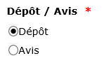

Remarque – Les sociétés peuvent téléverser plusieurs documents en un
seul dépôt (maximum de 20 documents, chacun pouvant atteindre une taille
de 50 Mo). Les sociétés sont **fortement encouragées à soumettre des
documents dans leur intégralité et à éviter le fractionnement de ceux-ci
dans la mesure du possible** (p. ex., en rassemblant la lettre
d’accompagnement, les renseignements sur le dépôt et les annexes pour
les déposer en seul document d’une taille pouvant aller jusqu’à 50 Mo).
Pour les documents plus volumineux, il est possible que plusieurs dépôts
soient requis.

Si vous éprouvez des difficultés à déposer des documents au moyen du
SSEL et devez procéder autrement, consultez le `Guide du dépôt
électronique à l’intention des
déposants <http://www.cer-rec.gc.ca/pplctnflng/rgltrdcmnt/guide-fra.pdf>`__
de la Régie.

Étape 4 – Information sur le dépôt / l’avis

Cette étape permet de fournir de l’information sur le dépôt ou l’avis.

Plusieurs instruments de réglementation, tâches, conditions, mesures à
prendre et composants peuvent être sélectionnés lorsque votre dépôt
porte sur **plusieurs éléments ou l’ensemble de ceux‑ci**.

Dans le cas où une tâche est créée à l’égard d’un dépôt relatif à une
condition déjà effectué (p. ex., une DR est créée pour obtenir des
précisions sur des documents relatifs à des conditions déjà déposés),
*sélectionnez uniquement* la tâche créée et les mesures à prendre
applicables (c.-à-d. *ne sélectionnez pas* la condition).

Cliquez sur le bouton jaune « Ajouter » approprié pour ajouter votre
sélection. Les renseignements sur la sélection apparaîtront au-dessus
des cases de sélection.

Pour supprimer une sélection, cliquez sur le bouton |image1| qui se
trouve à la droite de votre sélection.

Instrument / Tâche

Sélectionnez l’instrument ou la tâche applicable dans la liste
déroulante « **Instrument / Tâche** » et cliquez sur le bouton jaune
« **Ajouter un instrument / une tâche entière** » qui se trouve à côté
de la liste déroulante « **Condition / Mesure à prendre** ».

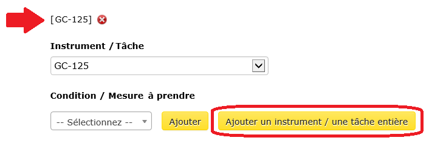

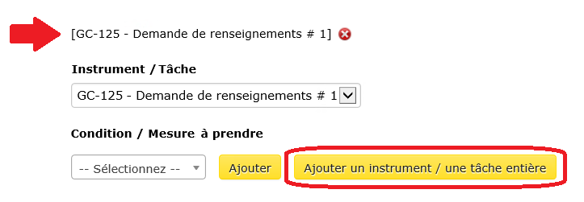

Si l’instrument ou la tâche applicable ne figure pas dans la liste
déroulante, communiquez avec le gestionnaire de projet aux opérations
(voir la section `Précisions sur le
projet <#coordonnées-du-gestionnaire-de-projet-aux-opérations>`__).
Celui-ci est responsable de la création des entrées dans le SSEL, s’il y
a lieu, pour l’instrument ainsi que pour les conditions et les
composants qui y sont reliés (ou la tâche et les mesures à prendre
connexes). Une fois les entrées créées dans le SSEL, tous les documents
doivent être déposés en lien avec ces éléments.

Si le gestionnaire de projet aux opérations ne peut être joint et que le
dépôt est urgent, vous pouvez sélectionner l’instrument (s’il apparaît
dans la liste déroulante) auquel se rapporte le dépôt et cliquer sur le
bouton jaune « **Ajouter un instrument / une tâche entière** » qui se
trouve à côté de la liste déroulante « **Condition / Mesure à
prendre** ».

Condition / Mesure à prendre

Sélectionnez la condition ou la mesure à prendre appropriée dans la
liste déroulante « **Condition / Mesure à prendre** ».

Cliquez sur le bouton jaune « **Ajouter** » qui se trouve à côté de
celle-ci.

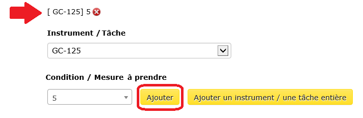

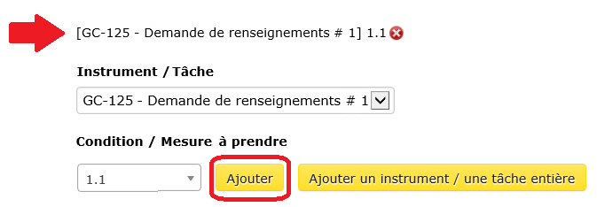

Si le document déposé s’applique à toutes les conditions ou mesures à
prendre, ne sélectionnez aucun élément dans la liste déroulante
« **Condition / Mesure à prendre** » et cliquez sur le bouton jaune
« **Ajouter un instrument / une tâche entière** ».

.. image:: CMSMedia/image24.png
   :width: 5.05208in
   :height: 1.72412in

Si la condition ou la mesure à prendre applicable ne figure pas dans la
liste déroulante, communiquez avec le gestionnaire de projet aux
opérations.

Composant

Sélectionnez le composant applicable dans la liste déroulante
« **Composant** ».

Cliquez sur le bouton jaune « **Ajouter** » qui se trouve à côté de
celle-ci.

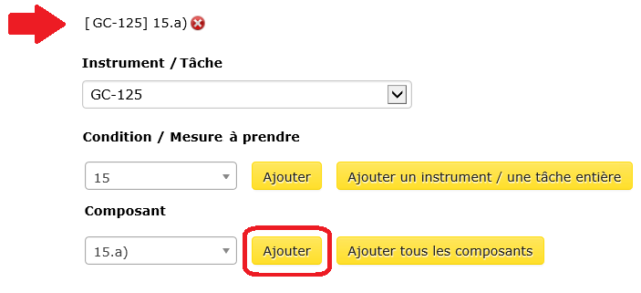

Si le dépôt s’applique à tous les composants, ne sélectionnez aucun
élément dans la liste déroulante « **Composant** » et cliquez sur le
bouton jaune « **Ajouter tous les composants** ».

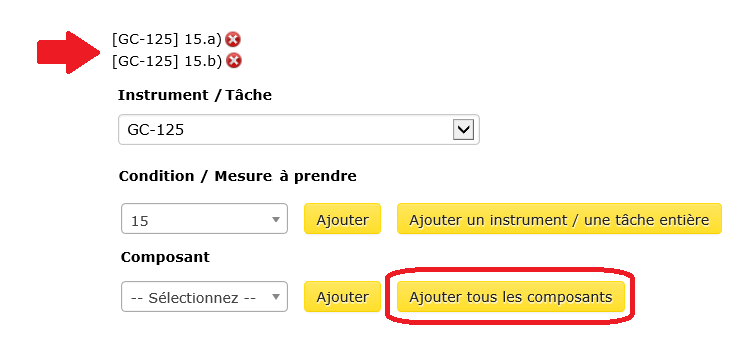

Remarque – Les composants ne s’appliquent qu’aux conditions. Il est
possible qu’une condition n’ait aucun composant.

Si le composant applicable ne figure pas dans la liste déroulante,
communiquez avec le gestionnaire de projet aux opérations.

Étape 5 – Titre du dépôt et sélection des fichiers

Dans le champ « **Titre du dépôt** », entrez un titre concis (c.-à-d.
bref, mais complet) pour le fichier soumis.

Exemples :

-  Calendrier de construction

-  Caractéristiques techniques à jour

-  Lettre de confirmation de l’achèvement du projet

-  Plan de protection de l’environnement

**Ne pas inclure** le nom de la société, l’instrument, le numéro de
condition, etc., dans le titre, car cette information est créée
automatiquement par le SSEL au moment du dépôt et figurera ainsi dans
REGDOCS.

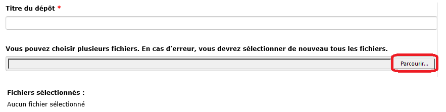

Cliquez sur « **Parcourir »** pour sélectionner le ou les documents (en
format PDF seulement), jusqu’à concurrence de 20 fichiers.

Une fois sélectionnés, tous les documents seront énumérés sous la
rubrique « Fichiers sélectionnés ». En cas d’erreur, l’utilisateur doit
sélectionner **à nouveau tous les documents**.

Remarque – Les sociétés peuvent téléverser plusieurs documents en un
seul dépôt (maximum de 20 documents, chacun pouvant atteindre une taille
de 50 Mo). Les sociétés sont **fortement encouragées à soumettre des
documents dans leur intégralité et à éviter le fractionnement de ceux-ci
dans la mesure du possible** (p. ex., en rassemblant la lettre
d’accompagnement, les renseignements sur le dépôt et les annexes pour
les déposer en seul document d’une taille pouvant aller jusqu’à 50 Mo).
Pour les documents plus volumineux, il est possible que plusieurs dépôts
soient requis.

Une fois les étapes 1 à 5 terminées, cliquez sur le bouton vert
« **Transmettre** ».

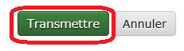

Remarque – Le système peut prendre plusieurs minutes pour télécharger
des fichiers qui se rapprochent de la taille maximale de 50 Mo ou pour
télécharger les dépôts comportant plusieurs fichiers. Ne rafraîchissez
pas la page pendant le téléchargement. Si celui-ci échoue, un message
d’erreur s’affichera. Si le problème persiste, écrivez à
`dlerssupport@cer-rec.gc.ca <mailto:DLERSSupport@rec-cer.gc.ca>`__. Si
le dépôt est urgent, effectuez-le au moyen de la page Web `Déposer une
demande ou un
document <https://www.cer-rec.gc.ca/fr/demandes-audiences/deposer-demande-documents/index.html>`__
**et** avisez le gestionnaire de projet aux opérations.

Une large barre verte apparaîtra dans le haut de l’écran lorsque le
document aura été transmis avec succès.

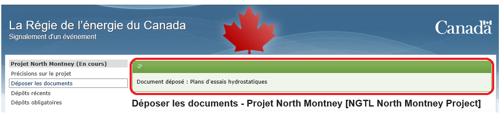

**Accusé de réception**

Une fois le dépôt transmis, l’utilisateur reçoit un accusé de réception
par courriel. Celui-ci est également disponible dans le dossier de dépôt
dans REGDOCS. Si vous n’avez pas reçu l’accusé de réception et que vous
en avez besoin, communiquez avec le gestionnaire de projet aux
opérations pour demander un nouvel envoi par courriel.

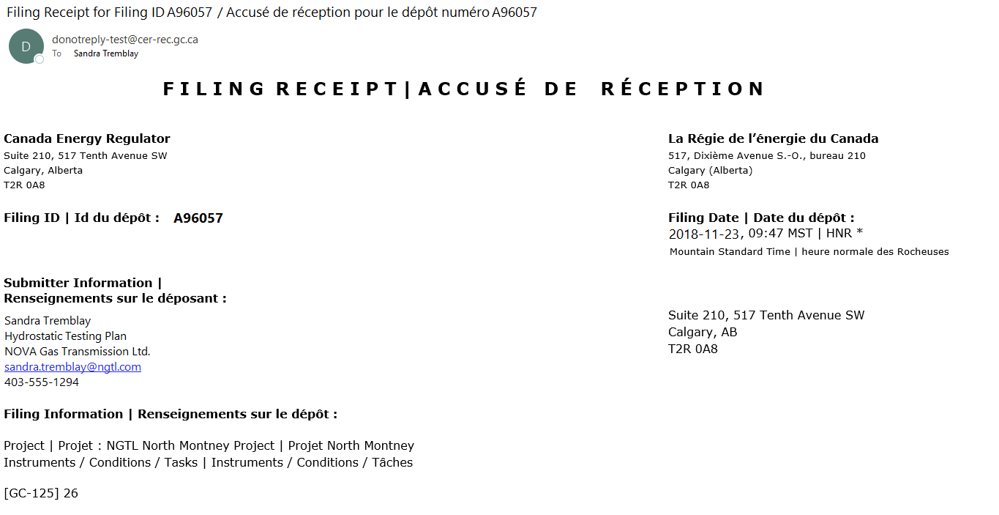

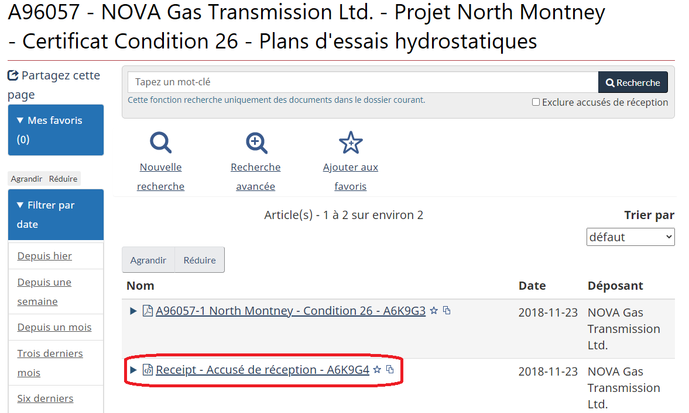

Rétraction d’un dépôt
---------------------

Si un dépôt présente des erreurs, l’utilisateur doit soumettre une
demande de rétractation pour celui-ci dans un délai de **24 heures**
suivant la soumission et soumettre un dépôt adéquat.

Étape 1.

Dans le **menu principal**, cliquez sur « **Dépôts récents** ».

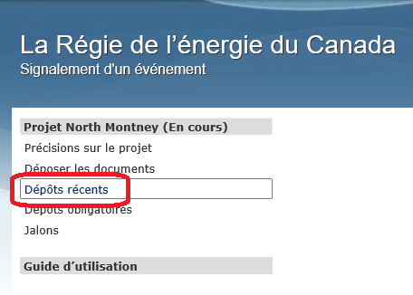

Étape 2.

Cliquez sur le bouton bleu « **Rétraction** ».

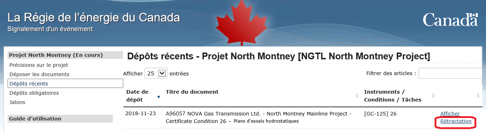

Étape 3.

Entrez un motif de rétractation et cliquez sur « **Enregistrer** ». Une
fois la demande de rétractation acceptée, le gestionnaire de projet aux
opérations prendra les mesures nécessaires pour retirer le document de
REGDOCS, dans la mesure du possible.

Modification de la date associée à un jalon
-------------------------------------------

On s’attend à ce que les sociétés soumettent des dates pour les jalons
des principaux événements qui déclencheront le dépôt de documents. Les
dates fournies précédemment doivent être modifiées pour tenir compte des
changements proposés au calendrier des activités pour le projet de la
société.

Le SSEL utilisera les dates fournies pour calculer les dates limites de
dépôt.

Étape 1.

Dans le **menu principal**, cliquez sur « **Jalons** ».

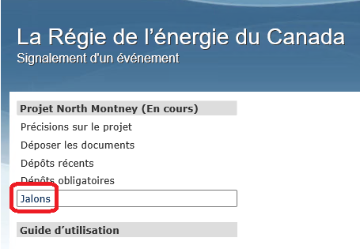

Étape 2.

Cliquez sur le lien « **Modifier** », à droite d’un jalon en particulier
pour en changer la date.

Étape 3.

Entrez une nouvelle date dans le champ « **Nouvelle date du jalon** » et
ajoutez un commentaire dans le champ « **Remarque / Justification** »
expliquant pourquoi la date a été modifiée.

Cliquez sur « **Enregistrer** ».

Une fois que vous aurez cliqué sur « **Enregistrer** », il ne sera plus
possible de modifier la date du jalon jusqu’à ce qu’elle ait été
acceptée ou refusée par le gestionnaire de projet aux opérations.

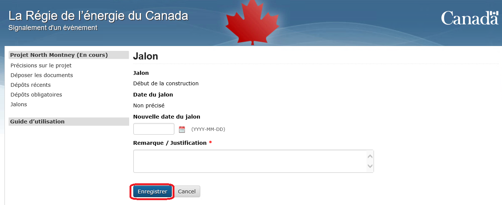

Le gestionnaire de projet aux opérations acceptera ou refusera chaque
demande de modification et l’utilisateur recevra un courriel du SSEL
confirmant la décision.

**Acceptation des dates des jalons**

Si la date associée au jalon est acceptée, l’avis par courriel peut
inclure ou non une justification de cette décision. La date acceptée
permettra au SSEL de calculer automatiquement les dates de dépôt des
documents requis pour ce jalon précis. L’acceptation d’une date de jalon
**ne doit pas être considérée comme une décision qui constitue une
approbation d’une exigence réglementaire**, y compris des conditions,
liée à ce jalon précis du projet.

**Refus des dates des jalons**

Si la date du jalon est refusée, l’avis par courriel expliquera
pourquoi. Le refus d’une date de jalon **ne doit pas être considéré
comme une décision qui constitue un refus d’une exigence réglementaire**
liée à ce jalon précis du projet.

Un tel refus peut indiquer que la demande a été soumise incorrectement
ou que certaines exigences réglementaires n’ont pas encore été
satisfaites ou approuvées par la Commission. Si la demande est refusée,
une nouvelle date de jalon doit être fournie par la société.

Foire aux questions
===================

**Q. Comment dépose-t-on un document?**

R : Reportez-vous aux directives de la section `Dépôt de
documents <#dépôt-de-documents>`__.

**Q : Puis-je soumettre un document qui se rapporte à plusieurs
conditions d’un instrument ou de plusieurs instruments différents?**

R : Oui. Plusieurs éléments peuvent être sélectionnés et ajoutés lorsque
la soumission vise plusieurs ou tous les éléments sélectionnés et
ajoutés à partir des listes déroulantes appropriées. Reportez-vous aux
directives de la section `Dépôt de documents <#dépôt-de-documents>`__.

**Q : Puis-je soumettre un document lié à une condition en même temps
qu’une demande de modification (p. ex., des mesures demandées ou des
mises à jour d’un projet)?**

R : Oui. Plusieurs éléments peuvent être sélectionnés et ajoutés lorsque
la soumission vise plusieurs ou tous les éléments sélectionnés et
ajoutés à partir des listes déroulantes appropriées. Reportez-vous aux
directives de la section `Dépôt de documents <#dépôt-de-documents>`__.

**Q : Comment puis-je vérifier le statut d’un dépôt?**

R : Pour vérifier le statut d’un dépôt, rendez-vous à la page
« **Précisions sur projet** » et cliquez sur le lien « **Afficher** » en
bleu sous « **Instruments** » ou « **Tâches connexes** ». Une fois sur
la page de l’instrument ou de la tâche, faites glisser le curseur de la
souris sur un élément précis pour obtenir des renseignements détaillés.

Vous pouvez aussi cliquer sur « **Vérification du statut** » sous
« **Instruments** » ou « **Tâches connexes** » à la page « **Précisions
sur projet** ».

**Q : Comment puis-je modifier la date associée à un jalon?**

R : Reportez-vous aux directives de la section `Modification de la date
associée à un jalon <#_How_to_Edit>`__.

**Q : Comment puis-je mettre à jour les coordonnées des
personnes-ressources de la société pour un projet?**

R : Chaque fois qu’un document est soumis, les coordonnées doivent être
indiquées.

Remarque – Cochez la case « **Cochez la case pour sauvegarder les
coordonnées; elles apparaîtront automatiquement la prochaine fois que
vous remplirez le formulaire** » pour enregistrer les coordonnées du
déposant pour le dépôt actuel et les dépôts subséquents.

   Pour mettre à jour les coordonnées des personnes-ressources de la
   société (c.-à-d. les modifier, les supprimer ou ajouter une nouvelle
   personne-ressource), communiquez avec le gestionnaire de projet aux
   opérations.

