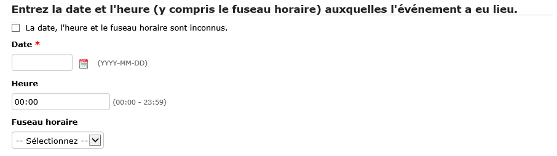
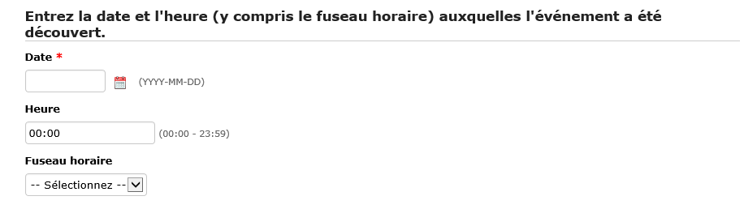
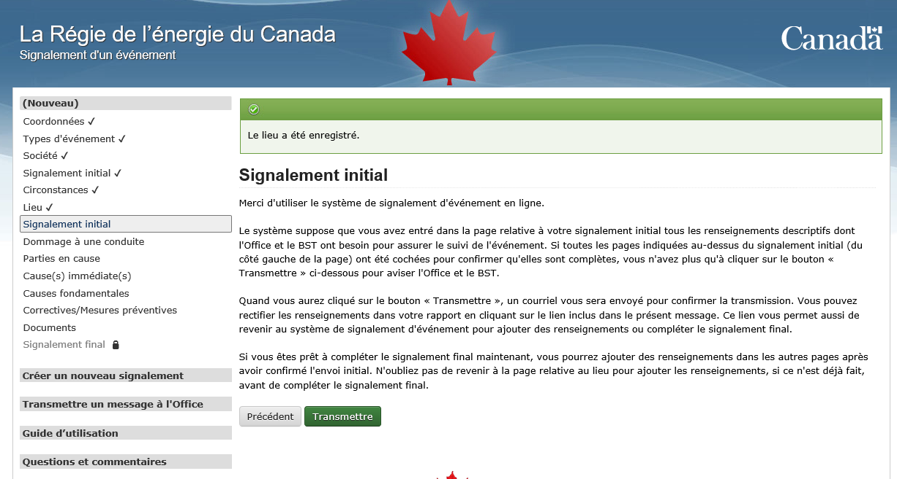
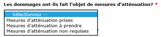
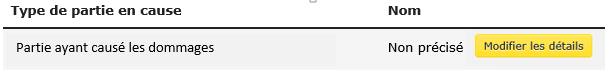
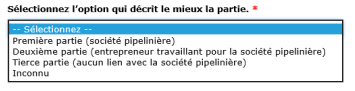
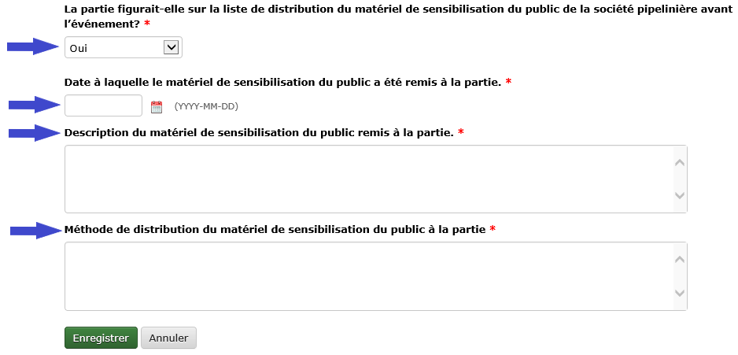
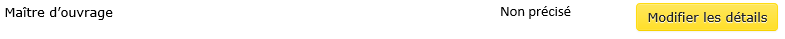
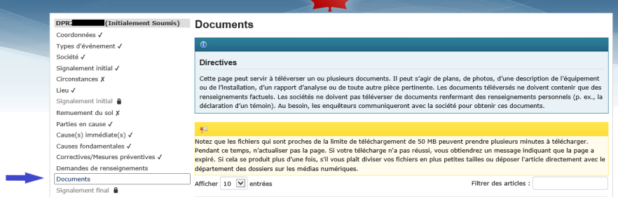
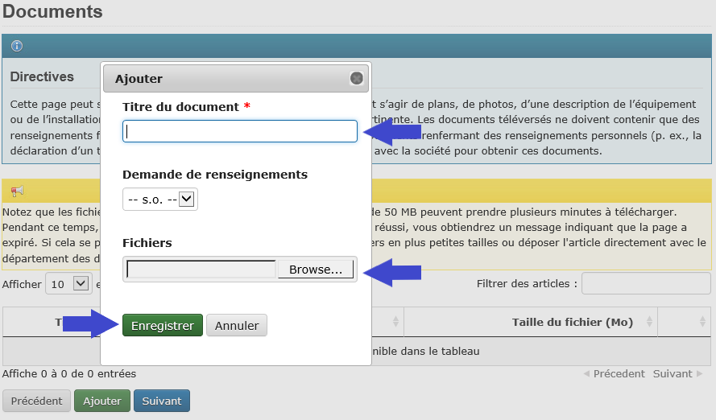

Signaler les événements de Contraventions au Réglement de la Régie Canadienne de L’Énergie sur La Prévention des Dommages Aux Pipelines
=======================================================================================================================================

1. Introduction
---------------

Le système de signalement d’événement en ligne (« SSEL ») a été créé
pour permettre aux sociétés de signaler directement à la Régie de
l’énergie du Canada les événements liés à la réglementation. Le SSEL
fait partie du système ORCA (l’application de conformité réglementaire
des activités), qui permet aux sociétés de consulter leurs rapports
d’activités de vérification de la conformité, de soumettre des documents
en application des conditions, d’en consulter l’état et de communiquer
avec le personnel de la Régie.

Dans le présent guide se trouvent les instructions et lignes directrices
sur la façon d’utiliser le SSEL pour signaler une contravention au
*Règlement de la Régie canadienne de l’énergie sur la prévention des
dommages aux pipelines* (régime d’autorisation) (le
« \ *Règlement *\ »), des dommages à une conduite et toute information
requise par le système.

Pour en savoir plus sur les autres types d’événement devant être
signalés et pour de plus amples renseignements sur ceux-ci (p. ex.,
signalement d’un incident), consultez les `*Lignes directrices sur les
rapports
d’événement* <https://www.cer-rec.gc.ca/fr/regie/lois-reglements/loi-regie-canadienne-lenergie-reglements-notes-dorientation-documents-connexes/lignes-directrices-rapports-evenement/2020drftvntrprtnggdlns-fra.pdf>`__
ou le `*Guide sur le processus de
réhabilitation* <https://www.cer-rec.gc.ca/fr/securite-environnement/environnement/remediation-contamination/index.html>`__
de la Régie.

2. Transmettre un message à la Régie
------------------------------------

Pour toute question technique sur un événement signalé en lien avec la
réglementation, ou pour demander le retrait de votre signalement (voir
la section 5.1.2 plus loin), veuillez utiliser la fonction **Transmettre
un message** dans le menu de gauche du SSEL. Cette fonction envoie
automatiquement votre demande au personnel de la Régie responsable de
votre dossier.

Si des problèmes techniques vous empêchent d’utiliser cette fonction ou
pour toute demande générale non liée à un événement signalé, veuillez
écrire à DLERSSupport@rec-cer.gc.ca; le personnel de la Régie répondra
dans un délai d’un jour ouvrable.

3. Dommage à une conduite et contraventions au *Règlement* à signalement obligatoire
------------------------------------------------------------------------------------

Pour déterminer si un événement doit être signalé à la Régie, consultez
les `*Lignes directrices sur les rapports
d’événement* <https://www.cer-rec.gc.ca/fr/regie/lois-reglements/loi-regie-canadienne-lenergie-reglements-notes-dorientation-documents-connexes/lignes-directrices-rapports-evenement/2020drftvntrprtnggdlns-fra.pdf>`__
de la Régie.

4. Création d’un événement et soumission du SIGNALEMENT INITIAL
---------------------------------------------------------------

La première étape d’un signalement consiste à créer un événement de
dommage à une conduite ou de contravention au *Règlement* dans le SSEL.
La présente section explique toutes les étapes de la création d’un tel
événement dans le SSEL, jusqu’à la soumission du signalement initial à
la Régie.

4.1 Accès au SSEL
^^^^^^^^^^^^^^^^^

Pour créer un événement, accédez au SSEL comme suit :

1. Accédez au SSEL à partir d’Internet en utilisant l’adresse URL
   suivante : \ https://apps.rec-cer.gc.ca/ERS/Accueil/Index/.

2. La page d’accueil ci-dessous apparaît.

3. Lisez l’information de la page d’accueil et cliquez sur **Continuer**
   pour commencer la création d’un événement.

   |image0|

4.2 Coordonnées
^^^^^^^^^^^^^^^

Saisissez l’information demandée dans la page **Coordonnées**. Les
champs marqués d’un astérisque rouge sont obligatoires.

Il faut au minimum fournir votre prénom, nom, numéro de téléphone au
travail et adresse de courriel. Cochez la case reCAPTCHA pour prouver
que vous n’êtes pas un robot, puis cliquez sur **Enregistrer et
suivant** au bas de la page.

|image1|

4.3 Confirmation par courriel
^^^^^^^^^^^^^^^^^^^^^^^^^^^^^

Une fois l’information saisie à l’étape 4.2, la page **Confirmation par
courriel** (voir ci-dessous) apparaît, et un message de confirmation est
automatiquement envoyé à l’adresse courriel fournie. Si le message
n’apparaît pas dans la boîte de réception, vérifiez le courrier
indésirable.

Le corps du courriel de confirmation contient un lien direct au nouvel
événement dans le SSEL. Cliquez sur le lien pour accéder à l’événement.
Des précisions peuvent être ajoutées avant la soumission à la Régie. Si
le lien ne renvoie pas au SSEL, communiquez avec la Régie à
DLERSSupport@rec-cer.gc.ca pour obtenir de l’aide.

|image2|

4.4 Types d’événement
^^^^^^^^^^^^^^^^^^^^^

Une fois le lien du courriel utilisé pour accéder au SSEL, la page
**Types d’événement** ci-dessous apparaît.

|image3|

1. ***S’agit-il d’un exercice?***

    Indiquez si l’événement signalé est un exercice (**Oui** ou
    **Non**).

    | Sélectionnez **Oui** s’il s’agit d’un exercice.
    | Sélectionnez **Non** s’il s’agit d’un événement réel.

2. Dans la section **Contraventions et dommages à une conduite**,
   sélectionnez le type d’événement signalé. Les contraventions au
   *Règlement* sont couramment appelées « activités non autorisées ».
   Sélectionnez le ou les types d’événement qui conviennent le mieux à
   la ou aux activités à l’origine de la contravention.

    Si les dommages à la conduite ne sont pas liés à une contravention
    (p. ex., dommages antérieurs), sélectionnez le type d’événement
    **Dommages à la conduite**.

    Les types d’événement entrant dans la catégorie **Contraventions et
    dommages à une conduite** sont les suivants :

-  Passage de véhicule (franchissement avec un véhicule)

-  Remuement du sol (perturbation du sol)

-  Construction d’une installation

-  Dommages à la conduite

**4.4.1 Types d’événement multiples**
~~~~~~~~~~~~~~~~~~~~~~~~~~~~~~~~~~~~~

Une seule activité peut être associée à plusieurs types d’événement. Le
cas échéant, les sociétés pipelinières doivent signaler plusieurs types
d’événement dans un même rapport **en sélectionnant tous les types
applicables**. Quelques exemples sont présentés ci-dessous.

4.4.1.1 Exemple 1 : installation d’une clôture
##############################################

Une excavation (l’activité) a causé un remuement du sol qui contrevient
au *Règlement* (type d’événement : remuement du sol), et un poteau de
clôture a été installé dans le trou sur l’emprise sans consentement
écrit (type d’événement : construction d’une installation).

Dans cet exemple, **deux** types d’événement doivent être sélectionnés :
**remuement du sol** et **construction d’une installation** (voir
ci-dessous).

|image4|

4.4.1.2 Exemple 2 : excavation ayant endommagé une conduite
###########################################################

Une excavation (l’activité) a causé un remuement du sol qui contrevient
au *Règlement* (type d’événement : remuement du sol), ce qui a endommagé
une conduite (type d’événement : dommages à la conduite).

Dans cet exemple, **deux** types d’événement doivent être sélectionnés :
**remuement du sol** et **dommages à la conduite** (voir ci-dessous).

|image5|

4.4.1.3 Exemple 3 : aménagement paysager
########################################

Lors d’un aménagement paysager (l’activité), un chargeur à direction à
glissement a traversé l’emprise d’un pipeline sans consentement écrit
(type d’événement : passage de véhicule), une partie de la couverture de
terre a été retirée de l’emprise du pipeline (type d’événement :
remuement du sol), et une terrasse en béton a été coulée sur l’emprise
sans consentement écrit (type d’événement : construction d’une
installation).

Dans cet exemple, **trois** types d’événement doivent être
sélectionnés : **passage de véhicule**, **remuement du sol** et
**construction d’une installation** (voir ci-dessous).

|image6|

Une fois le ou les types d’événement applicables sélectionnés, cliquez
sur **Enregistrer et suivant** au bas de la page pour passer à la page
suivante.

4.5 Société
^^^^^^^^^^^

Sélectionnez le nom de la société qui exploite le pipeline endommagé ou
associé à la contravention. Si le nom de la société n’est pas dans la
liste, communiquez avec la Régie au DLERSSupport@rec-cer.gc.ca pour
obtenir de l’aide.

|image7|

4.5.1 Sélection des règlements applicables
~~~~~~~~~~~~~~~~~~~~~~~~~~~~~~~~~~~~~~~~~~

Une fois la société sélectionnée à l’étape 4.5, une liste de règlements
est automatiquement générée à l’écran.

|image8|

-  Si le signalement porte sur des **dommages à une conduite non liés à
   une contravention au *Règlement***, le *Règlement de la Régie
   canadienne de l’énergie sur la prévention des dommages aux pipelines
   (obligations des compagnies pipelinières)* constituera la seule
   option possible.

Une fois le ou les règlements applicables sélectionnés, cliquez sur
**Enregistrer et suivant** au bas de la page pour passer à la page
suivante.

4.6 Signalement initial
^^^^^^^^^^^^^^^^^^^^^^^

La page suivante est intitulée **Signalement initial**. Les trois
premières questions de tout signalement initial de dommages à une
conduite ou de contravention au *Règlement* abordent l’aspect préventif
et s’il y a eu contact avec la conduite ou dommage à celle-ci (voir
ci-dessous).

|image9|

4.6.1 S’agit-il d’un signalement fondé sur la prudence?
~~~~~~~~~~~~~~~~~~~~~~~~~~~~~~~~~~~~~~~~~~~~~~~~~~~~~~~

La Régie a demandé aux sociétés d’adopter une approche de signalement
préventive. Par conséquent, elle s’attend à ce qu’elles signalent des
événements suspects avant de confirmer les derniers détails. Pour
indiquer qu’un signalement est fondé sur la prudence, sélectionnez
**Oui**. Pour en savoir plus sur le signalement fondé sur la prudence,
consultez les `*Lignes directrices sur les rapports
d’événement* <https://www.cer-rec.gc.ca/fr/regie/lois-reglements/loi-regie-canadienne-lenergie-reglements-notes-dorientation-documents-connexes/lignes-directrices-rapports-evenement/2020drftvntrprtnggdlns-fra.pdf>`__
de la Régie\ *.*

4.6.2. Y a-t-il eu contact avec la conduite?
~~~~~~~~~~~~~~~~~~~~~~~~~~~~~~~~~~~~~~~~~~~~

Dans le menu déroulant, sélectionnez **Oui**, **Non** ou
**Indéterminé**.

|image10|

En cas de contact potentiel mais **indéterminé** dans un délai de
24 heures après la découverte de l’événement, et s’il n’y a pas de
contravention au *Règlement* signalée, sélectionnez **Oui** dans le menu
déroulant décrit à la section 4.6.1 ci-dessus (« S’agit-il d’un
signalement fondé sur la prudence? ») pour indiquer à la Régie que le
signalement est fondé sur la prudence. La situation et les circonstances
pourront être détaillées à la page **Circonstances** (voir la
section 4.7 plus loin).

4.6.3. La conduite a-t-elle été endommagée?
~~~~~~~~~~~~~~~~~~~~~~~~~~~~~~~~~~~~~~~~~~~

Dans le menu déroulant, sélectionnez **Oui**, **Non** ou
**Indéterminé**.

|image11|

Si **Oui** est sélectionné, le SSEL génère automatiquement des questions
supplémentaires concernant le dommage à la conduite (voir la
section 4.6.3.2 ci-dessous).

En cas de dommage potentiel mais **indéterminé** dans un délai de
24 heures après la découverte de l’événement, et s’il n’y a pas de
contravention au *Règlement* signalée, sélectionnez **Oui** dans le menu
déroulant décrit à la section 4.6.1 ci-dessus (« S’agit-il d’un
signalement fondé sur la prudence? ») pour indiquer à la Régie que le
signalement est fondé sur la prudence. La situation et les circonstances
pourront être détaillées à la page **Circonstances** (voir la
section 4.7 plus loin).

4.6.3.1 Contact avec la conduite sans dommage
#############################################

Si la contravention au *Règlement* a eu pour résultat un **contact avec
la conduite sans dommage**, il faut indiquer si l’absence de dommage a
été déterminée par une personne compétente ou sous sa supervision
directe. Dans le menu déroulant, sélectionnez **Oui** ou **Non**. Si
**Non** est sélectionné, le SSEL génère automatiquement une boîte de
texte dans laquelle des détails doivent être fournis.

|image12|

4.6.3.2 Dommages à une conduite
###############################

Si la réponse **Oui** a été sélectionnée à la question **« La conduite
a-t-elle été endommagée? »** (voir la section 4.6.3 ci-dessus), le SSEL
génère automatiquement des questions supplémentaires (voir ci‑dessous).

**Dommages à une conduite – le revêtement a-t-il été endommagé?**

Dans le menu déroulant, sélectionnez **Oui** ou **Non**.

|image13|

Si **Oui** est sélectionné, décrivez les dommages et la réparation (le
cas échéant) dans la nouvelle boîte de texte.

|image14|

**Dommages à une conduite – la conduite a-t-elle été endommagée?**

Dans le menu déroulant, sélectionnez **Oui** ou **Non**.

|image15|

Si **Oui** est sélectionné :

-  Une liste de sélection apparaît avec les options **Rainure**,
   **Bosselure** et **Autre**.

    |image16|

-  Décrivez les dommages dans la boîte de texte qui apparaît.

    |image17|

-  Répondez à la question **« Une évaluation technique (selon la norme
   CSA Z662) sera-elle requise? »**. Dans le menu déroulant,
   sélectionnez **Oui**, **Non, S.O.** ou **Indéterminé**.

    |image18|

**Constatation des dommages**

Lorsqu’une conduite est endommagée, il faut indiquer si la présence de
dommages a été déterminée par une personne compétente ou sous sa
supervision directe. Dans le menu déroulant, sélectionnez **Oui** ou
**Non**. Si **Non** est sélectionné, le SSEL génère automatiquement une
boîte de texte dans laquelle des détails doivent être fournis.

|image19|

4.6.4 Entrez la date et l’heure (y compris le fuseau horaire) auxquelles l’événement a eu lieu
~~~~~~~~~~~~~~~~~~~~~~~~~~~~~~~~~~~~~~~~~~~~~~~~~~~~~~~~~~~~~~~~~~~~~~~~~~~~~~~~~~~~~~~~~~~~~~

Tous les signalements de dommages à une conduite ou de contravention au
*Règlement* doivent indiquer la date et l’heure de l’événement, si ces
données sont connues.

|image20|

4.6.4.1 Date et heure de l’événement inconnues
##############################################

Si la date, l’heure et le fuseau horaire de l’événement sont
**inconnus**, cochez la case indiquée ci-dessous.

|image21|

4.6.4.1.1 Dommages antérieurs à la conduite
```````````````````````````````````````````

Si la conduite a été endommagée et que la case indiquant que la date,
l’heure et le fuseau horaire sont **inconnus** est cochée (voir la
section 4.6.4.1 ci-dessus), le SSEL génère automatiquement la question
obligatoire **« Croit-on qu’il s’agit de dommages antérieurs? »** (voir
ci-dessous). Sélectionnez **Oui**, **Non** ou **Inconnue**.

|image22|

4.6.5 Entrez la date et l’heure (y compris le fuseau horaire) auxquelles l’événement a été découvert
~~~~~~~~~~~~~~~~~~~~~~~~~~~~~~~~~~~~~~~~~~~~~~~~~~~~~~~~~~~~~~~~~~~~~~~~~~~~~~~~~~~~~~~~~~~~~~~~~~~~

Tous les signalements de dommages à une conduite ou de contravention au
*Règlement* doivent indiquer la date et l’heure (y compris le fuseau
horaire) auxquelles l’événement a été découvert. La société pipelinière
doit signaler les dommages à une conduite et les contraventions au
*Règlement* dès que possible et dans les 24 heures suivant la découverte
de l’événement. En cas d’incertitude à savoir si l’événement doit ou non
être signalé, il est recommandé de faire un signalement fondé sur la
prudence (voir la section 4.6.1).

|image23|

4.6.6 Qui a découvert l’événement?
~~~~~~~~~~~~~~~~~~~~~~~~~~~~~~~~~~

Dans le menu déroulant, sélectionnez la partie applicable.

|image24|

4.6.6.1 Méthode de découverte – Première ou deuxième partie
###########################################################

Si la **première** ou la **deuxième partie** découvre l’événement, le
SSEL génère les questions supplémentaires ci-dessous.

1. Dans le menu déroulant, sélectionnez la méthode de découverte
   (**Patrouille aérienne**, **Patrouille au sol**, **Visite des lieux**
   ou **Autre**). Si **Autre** est sélectionné, précisez dans la boîte
   de texte qui apparaît.

|image25|

1. Si **Patrouille aérienne**, **Patrouille au sol** ou **Visite des
   lieux** est sélectionné, le SSEL demande automatiquement si la
   méthode de découverte était « \ **planifiée** ». Dans le menu
   déroulant, sélectionnez **Planifiée** ou **Non planifiée**.

|image26|

4.6.6.2 Méthode de découverte – Tierce partie
#############################################

Si une tierce partie découvre l’événement, le SSEL génère
automatiquement une question sur le **Type de tierce partie**. Dans le
menu déroulant, sélectionnez le type de tierce partie applicable. Si
**Autre** est sélectionné, précisez dans la boîte de texte qui apparaît.

|image27|

4.6.7 À quelle distance se situe l’activité par rapport à la signalisation la plus proche liée au pipeline?
~~~~~~~~~~~~~~~~~~~~~~~~~~~~~~~~~~~~~~~~~~~~~~~~~~~~~~~~~~~~~~~~~~~~~~~~~~~~~~~~~~~~~~~~~~~~~~~~~~~~~~~~~~~

Dans le menu déroulant, sélectionnez la distance applicable.

|image28|

Quand vous aurez répondu à toutes les questions, cliquez sur
**Enregistrer et suivant** au bas de la page.

4.7 Circonstances
^^^^^^^^^^^^^^^^^

La page **Circonstances** permet à la société pipelinière d’aviser la
Régie de toute préoccupation immédiate et de fournir une description
narrative de la situation et des événements signalés.

|image29|

4.7.1 La société a-t-elle des préoccupations immédiates?
~~~~~~~~~~~~~~~~~~~~~~~~~~~~~~~~~~~~~~~~~~~~~~~~~~~~~~~~

À la première question sur la page **Circonstances**, on cherche à
savoir si la société pipelinière a des préoccupations immédiates
concernant la sécurité des personnes, la sécurité des installations
réglementées et la protection des biens et de l’environnement.

Dans le menu déroulant, sélectionnez **Oui** ou **Non**.

|image30|

4.7.2 Description – circonstances ayant mené à l’événement et en découlant
~~~~~~~~~~~~~~~~~~~~~~~~~~~~~~~~~~~~~~~~~~~~~~~~~~~~~~~~~~~~~~~~~~~~~~~~~~

Décrivez en détail les circonstances ayant mené à l’événement et qui en
ont découlé, y compris les répercussions sur le pipeline, les biens et
l’environnement.

|image31|

4.7.3 Description – mesures prises ou prévues pour remédier aux conséquences de l’événement
~~~~~~~~~~~~~~~~~~~~~~~~~~~~~~~~~~~~~~~~~~~~~~~~~~~~~~~~~~~~~~~~~~~~~~~~~~~~~~~~~~~~~~~~~~~

Décrivez toutes les mesures prises ou prévues pour remédier aux
conséquences de l’événement, y compris les mesures d’atténuation,
réparations, remplacements et évacuations (p. ex., la conduite sera mise
à nu pour l’inspection; la société pipelinière a communiqué avec les
organismes provinciaux responsables de la santé et de la sécurité au
travail; le revêtement de la conduite a été réparé; la société
pipelinière a ouvert une enquête pour déterminer les causes).

|image32|

4.7.4 Circonstances – remuement du sol
~~~~~~~~~~~~~~~~~~~~~~~~~~~~~~~~~~~~~~

    Si un remuement du sol est signalé, le SSEL génère automatiquement
    deux questions supplémentaires sur l’équipement ayant causé le
    remuement du sol (s’il est connu) et la distance approximative entre
    le remuement du sol et le pipeline (voir ci-dessous).

|image33|

|image34|

Quand vous aurez répondu à toutes les questions, cliquez sur
**Enregistrer et suivant** au bas de la page.

4.8 Lieu
^^^^^^^^

La page **Lieu** doit être remplie pour tous les événements. Les
instructions se trouvent au haut de la page.

|image35|

|image36|

| |image37|
| Quand vous aurez répondu à toutes les questions, cliquez sur
  **Enregistrer et suivant** au bas de la page.

4.9 Signalement initial – soumission à la Régie
^^^^^^^^^^^^^^^^^^^^^^^^^^^^^^^^^^^^^^^^^^^^^^^

Le **signalement initial** est la première des deux étapes du processus
pour signaler des dommages à une conduite et une contravention au
*Règlement*.

|image38|

Lorsque toutes les pages au-dessus de **Signalement initial** ont un
crochet indiquant qu’elles ont été remplies (voir ci-dessus), c’est que
le signalement initial peut être soumis à la Régie au moyen du bouton
**Transmettre**.

-  Si une ou plusieurs pages au-dessus de **Signalement initial** ont
   une croix plutôt qu’un crochet, il faut y retourner et répondre aux
   questions avant de pouvoir soumettre le signalement initial à la
   Régie.

-  Les pages sous **Signalement initial** sont générées en fonction du
   ou des types d’événement. Dans la capture d’écran ci-dessus, les
   types d’événement sélectionnés étaient **Passage de véhicule**,
   **Remuement du sol**, **Construction d’une installation** et
   **Dommage à une conduite**.

-  Les pages sous **Signalement initial** devront être remplies pour le
   signalement final, mais ne sont **pas** requises pour le signalement
   initial.

4.9.1 Bouton Transmettre
~~~~~~~~~~~~~~~~~~~~~~~~

1. Lorsque vous cliquez sur le bouton **Transmettre**, le SSEL génère
   automatiquement un message demandant de confirmer la soumission.
   Cliquer sur **OK** pour continuer (voir ci-dessous).

|image39|

1. Le SSEL envoie un avis par courriel comprenant l’information
   suivante :

   a. Accusé de réception du signalement initial par la Régie.

   b. Identifiant alphanumérique unique assigné à l’événement. Pour les
      signalements de dommages à une conduite ou de contravention au
      *Règlement*, l’identifiant porte le préfixe DPR.

   c. Lien vers le SSEL pour réviser l’information ou en ajouter.

   d. Liste des renseignements fournis à la Régie dans le signalement
      initial.

2. Un avis est envoyé à l’interne à la Régie. À tout moment après le
   signalement initial, le personnel de la Régie peut communiquer avec
   vous pour faire un suivi.

3. Dans le menu de gauche du SSEL, la page **Signalement initial**
   affiche maintenant une icône de cadenas, comme ci-dessous.

|image40|

1. Pour soumettre le signalement final dès maintenant, il suffit de
   remplir les pages restantes.

2. Pour soumettre le signalement final plus tard, utilisez le lien reçu
   dans le courriel de confirmation du signalement initial de la Régie
   pour accéder au SSEL. Les délais de soumission d’un signalement final
   sont précisés à la section 7.4 des *Lignes directrices sur les
   rapports d’événement* de la Régie.

5. Soumission d’un SIGNALEMENT FINAL
------------------------------------

La présente section explique comment effectuer la deuxième étape
(signalement final) pour signaler des dommages à une conduite ou une
contravention au *Règlement* dans le SSEL. **Toutes les pages sous**
Signalement initial **dans le menu de gauche font partie du processus de
signalement final.**

5.1 Vérification du ou des types d’événement
^^^^^^^^^^^^^^^^^^^^^^^^^^^^^^^^^^^^^^^^^^^^

Dans le menu de gauche, les pages entre **Signalement initial** et
**Parties en cause** sont générées en fonction des types d’événement
indiqués dans le signalement initial. Chaque page contient des questions
propres aux types d’événement signalés.

Dans l’exemple ci-dessous, les types d’événement sélectionnés dans le
signalement initial étaient **Passage de véhicule**, **Remuement du
sol**, **Construction d’une installation** et **Dommage à une
conduite**. Il apparaît donc une page pour chacun d’eux (voir les
petites flèches bleues ci-dessous).

|image41|

Dans le menu de gauche, vérifiez les types d’événement signalés pour
valider que les pages applicables au signalement final s’affichent entre
**Signalement initial** et **Parties en cause**.

5.1.1 Ajout ou retrait d’un type d’événement
~~~~~~~~~~~~~~~~~~~~~~~~~~~~~~~~~~~~~~~~~~~~

À mesure que de nouvelles informations seront disponibles après la
soumission du signalement initial, des types d’événement de dommages à
une conduite ou de contravention au *Règlement* peuvent être **ajoutés**
ou **retirés** pour le **signalement final**. Voici comment faire :

1. Cliquez sur le lien **Types d’événement** dans le menu de gauche
   (voir la grande flèche bleue ci-dessus).

2. Ajoutez ou retirez les types d’événement applicables au signalement
   final. Voir la section 4.4 pour en savoir plus sur la page **Types
   d’événement**.

3. Une fois les types d’événement ajoutés ou enlevés, cliquez sur
   **Enregistrer et suivant** au bas de la page. La page **Société**
   apparaît automatiquement. **À noter que le menu de gauche demeure
   différent jusqu’à ce que l’information soit validée de nouveau à la
   page Société.**

    |image42|

1. Validez de nouveau le nom de la société et sélectionnez les
   règlements applicables, car ils pourraient avoir changé en fonction
   des types d’événement (voir la section 4.5 pour en savoir plus sur la
   page **Société**). Cliquez ensuite sur **Enregistrer et suivant** au
   bas de la page.

2. Les pages des types d’événement sont automatiquement mises à jour
   dans le menu de gauche en fonction de la sélection à l’étape 2.

3. Validez de nouveau l’information de la page **Circonstances**, puis
   cliquez sur **Enregistrer et suivant** au bas de la page.

5.1.2 Événements non visés par l’exigence de déclaration obligatoire – demande de retrait du signalement
~~~~~~~~~~~~~~~~~~~~~~~~~~~~~~~~~~~~~~~~~~~~~~~~~~~~~~~~~~~~~~~~~~~~~~~~~~~~~~~~~~~~~~~~~~~~~~~~~~~~~~~~

Comme il est indiqué à la section 5.1, les pages entre **Signalement
initial** et **Parties en cause** dans le menu de gauche sont générées
en fonction des types d’événement sélectionnés lors du signalement
initial et de ceux ajoutés par la suite (voir la section 5.1.1). Chaque
page contient des questions propres aux types d’événement signalés.

À mesure que de nouvelles informations seront disponibles après la
soumission du signalement initial, la société pipelinière peut
déterminer qu’il n’y a pas de dommage à une conduite ni de contravention
au *Règlement* et que le signalement doit être retiré. Exemples :

-  Après un examen approfondi, la société pipelinière confirme qu’il n’y
   a pas eu de construction d’installation le long de l’emprise, sur
   l’emprise ou sous celle-ci.

-  Après un examen approfondi, la société pipelinière confirme que le
   remuement du sol n’a pas dépassé 30 cm de profondeur et n’a pas
   réduit la couverture de terre sur le pipeline.

-  Un signalement fondé sur la prudence a été soumis et, après examen
   approfondi, la société pipelinière confirme qu’il n’y a pas de
   dommage à la conduite.

**Une demande de retrait du signalement doit être soumise à la Régie au
moyen de la fonction « Transmettre un message »** **dans le SSEL.** Pour
en savoir plus sur cette fonction, consultez la section 2.

5.2 Passage de véhicule
^^^^^^^^^^^^^^^^^^^^^^^

Lorsque le type d’événement **Franchissement avec un véhicule** est
sélectionné, la page **Passage de véhicule** ci-dessous doit être
remplie.

|image43|

5.2.1 Passage de véhicule – consentement écrit
~~~~~~~~~~~~~~~~~~~~~~~~~~~~~~~~~~~~~~~~~~~~~~

Si un consentement écrit a été donné avant le passage d’un véhicule ou
d’équipement mobile, un message d’avertissement apparaît indiquant que
l’événement n’a pas à être signalé (voir ci-dessous). Veuillez justifier
le signalement de l’événement ou retourner à la page **Types
d’événement** dans le menu de gauche pour désélectionner le type
**Franchissement avec un véhicule** (voir la section 5.1.1 ci-dessus).

|image44|

|image45|

5.2.2 Passage de véhicule – activité agricole
~~~~~~~~~~~~~~~~~~~~~~~~~~~~~~~~~~~~~~~~~~~~~

Dans le menu déroulant, sélectionnez **Oui** ou **Non**.

Si **Oui** est sélectionné, le SSEL génère des questions supplémentaires
(voir les sections 5.2.2.1 et 5.2.2.2 ci-dessous).

|image46|

5.2.2.1 Passage de véhicule – activité agricole – charge utile et pression des pneus
####################################################################################

Dans le menu déroulant, sélectionnez **Oui**, **Non** ou **Inconnue**.
Si **Non** est sélectionné, inscrivez des détails dans la boîte de texte
qui apparaît.

|image47|

5.2.2.2 Passage de véhicule – activité agricole – avis conformément à l’article 7 du *Règlement sur la prévention des dommages aux pipelines (obligations des compagnies pipelinières)*
#######################################################################################################################################################################################

Dans le menu déroulant, sélectionnez **Oui** ou **Non**. Si **Oui** est
sélectionné, inscrivez des détails dans la boîte de texte qui apparaît.

|image48|

5.2.3 Passage de véhicule – type de véhicule ou d’équipement mobile
~~~~~~~~~~~~~~~~~~~~~~~~~~~~~~~~~~~~~~~~~~~~~~~~~~~~~~~~~~~~~~~~~~~

Dans le menu déroulant, sélectionnez le type de véhicule ou d’équipement
mobile qui a franchi le pipeline. Si le type est inconnu, sélectionnez
**Inconnu**. Si **Autre équipement** est sélectionné, inscrivez des
détails dans la boîte de texte qui apparaît.

|image49|

5.2.4 Passage de véhicule – analyse de la charge de surface
~~~~~~~~~~~~~~~~~~~~~~~~~~~~~~~~~~~~~~~~~~~~~~~~~~~~~~~~~~~

Dans le menu déroulant, sélectionnez **Oui** ou **Non**. Si **Oui** est
sélectionné, fournissez un résumé comprenant les renseignements suivants
dans la boîte de texte qui apparaît :

-  Marque et modèle du véhicule ou de l’équipement mobile qui a franchi
   le pipeline

-  Répercussions possibles des charges appliquées lors du franchissement

   |image50|

Quand vous aurez répondu à toutes les questions, cliquez sur
**Enregistrer et suivant** au bas de la page.

5.3 Remuement du sol
^^^^^^^^^^^^^^^^^^^^

Lorsque le type d’événement **Perturbation du sol** est sélectionné, la
page **Remuement du sol** ci-dessous doit être remplie.

|image51|

5.3.1 Remuement du sol – type d’activité
~~~~~~~~~~~~~~~~~~~~~~~~~~~~~~~~~~~~~~~~

Dans le menu déroulant, sélectionnez le type d’activité à l’origine du
remuement du sol.

|image52|

Les choix suivants génèrent une boîte de texte dans laquelle des détails
doivent être fournis :

-  Travaux d’excavation pour l’aménagement d’une nouvelle installation

-  Travaux d’excavation pour l’entretien d’une installation

-  Autre

-  Inconnu

5.3.2 Remuement du sol – type d’équipement
~~~~~~~~~~~~~~~~~~~~~~~~~~~~~~~~~~~~~~~~~~

Dans le menu déroulant, sélectionnez le type d’équipement à l’origine du
remuement du sol.

|image53|

Si le type d’équipement est inconnu, sélectionnez **Inconnu**. Si le
type d’équipement n’est pas dans la liste, sélectionnez **Autre** et
fournissez des détails dans la boîte de texte qui apparaît.

5.3.3 Remuement du sol – distance à partir de l’axe central de la conduite
~~~~~~~~~~~~~~~~~~~~~~~~~~~~~~~~~~~~~~~~~~~~~~~~~~~~~~~~~~~~~~~~~~~~~~~~~~

Saisissez la distance à partir de l’axe central de la conduite et
sélectionnez **mètres** ou **centimètres** dans le menu déroulant. Si
l’activité a eu lieu directement au-dessus de la conduite, indiquez
« 0 ».

|image54|

Si la distance dépasse 30,0 mètres, un message d’avertissement apparaît
indiquant que l’événement n’a pas à être signalé (voir ci-dessous).
Justifiez le signalement de l’événement ou retournez à la page **Types
d’événement** pour désélectionner le type **Perturbation du sol** (voir
la section 5.1.1 ci-dessus).

|image55|

5.3.4 Remuement du sol – profondeur de l’activité
~~~~~~~~~~~~~~~~~~~~~~~~~~~~~~~~~~~~~~~~~~~~~~~~~

Saisissez la profondeur de l’activité et sélectionnez **mètres** ou
**centimètres** dans le menu déroulant.

|image56|

5.3.5 Remuement du sol – épaisseur de la couverture au-dessus de la conduite
~~~~~~~~~~~~~~~~~~~~~~~~~~~~~~~~~~~~~~~~~~~~~~~~~~~~~~~~~~~~~~~~~~~~~~~~~~~~

Saisissez l’épaisseur mesurée de la couverture et sélectionnez
**mètres** ou **centimètres** dans le menu déroulant.

|image57|

5.3.6 Remuement du sol – réduction de la couverture de terre au-dessus du pipeline
~~~~~~~~~~~~~~~~~~~~~~~~~~~~~~~~~~~~~~~~~~~~~~~~~~~~~~~~~~~~~~~~~~~~~~~~~~~~~~~~~~

Si l’activité a causé une réduction de la couverture de terre au-dessus
du pipeline, sélectionnez **Oui**. Saisissez ensuite la valeur de la
réduction en mètres ou en centimètres.

|image58|

**Si l’activité a eu lieu à une profondeur inférieure à 30 cm et n’a pas
réduit la couverture de terre au-dessus du pipeline**, un message
d’avertissement apparaît indiquant que l’événement n’a pas à être
signalé. Justifiez le signalement de l’événement ou retournez à la page
**Types d’événement** dans le menu de gauche pour désélectionner le type
**Perturbation du sol** (voir la section 5.1.1 ci-dessus).

|image59|

5.3.7 Remuement du sol – autorisation
~~~~~~~~~~~~~~~~~~~~~~~~~~~~~~~~~~~~~~

L’article 10 du *Règlement* définit les critères d’autorisation d’une
activité de remuement du sol dans la zone réglementaire. Les questions
suivantes (voir les captures d’écran) concernent l’autorisation. Si le
type d’activité sélectionné à la section 5.3.1 était **Travaux
d’excavation pour l’entretien d’une installation**, le SSEL affiche
automatiquement les questions d’autorisation liées à l’article 11 du
*Règlement* portant sur les activités d’entretien d’une installation.

5.3.7.1 Remuement du sol – consentement écrit
#############################################

Dans le menu déroulant, sélectionnez **Oui** ou **Non**.

|image60|

5.3.7.2 Remuement du sol – demande de localisation
##################################################

Dans le menu déroulant, sélectionnez **Oui** ou **Non**.

|image61|

-  Si **Oui** est sélectionné :

   -  Le SSEL demande si la conduite a été localisée avant le remuement
      du sol. Sélectionnez **Oui** ou **Non**. Si **Non** est
      sélectionné, veuillez fournir des détails dans la boîte de texte
      qui apparaît (voir ci-dessous).

   -  S’il est connu, le numéro de la demande au centre d’appel unique
      peut être saisi dans la boîte de texte facultative qui apparaît.

|image62|

5.3.7.3 Remuement du sol – obligations à la suite d’une demande de localisation
################################################################################

Dans le menu déroulant, sélectionnez **Oui** ou **Non**.

|image63|

5.3.7.4 Remuement du sol – mesures à suivre
###########################################

Dans le menu déroulant, sélectionnez **Oui**, **Non** ou **S.O.**. Si
aucun consentement écrit n’a été donné pour l’activité, sélectionnez
**S.O.**.

|image64|\ Si **Non** est sélectionné, le SSEL génère une liste des
mesures non respectées. **Sélectionnez toutes celles qui s’appliquent.**

|image65|

Quand vous aurez répondu à toutes les questions, cliquez sur
**Enregistrer et suivant** au bas de la page.

5.4 Construction d’une installation
^^^^^^^^^^^^^^^^^^^^^^^^^^^^^^^^^^^

Lorsque le type d’événement **Construction d’une installation** est
sélectionné, la page **Construction d’une installation** ci-dessous doit
être remplie.

|image66|

5.4.1 Construction d’une installation – emplacement
~~~~~~~~~~~~~~~~~~~~~~~~~~~~~~~~~~~~~~~~~~~~~~~~~~~

Dans le menu déroulant, sélectionnez **Oui** ou **Non**. |image67|

Si **Non** est sélectionné, un message d’avertissement apparaît
indiquant que l’événement n’a pas à être signalé (voir ci-dessous).
Justifiez le signalement de l’événement ou retournez à la page **Types
d’événement** pour désélectionner le type **Construction d’une
installation** (voir la section 5.1.1 ci‑dessus).

|image68|

5.4.2 Construction d’une installation – type d’installation
~~~~~~~~~~~~~~~~~~~~~~~~~~~~~~~~~~~~~~~~~~~~~~~~~~~~~~~~~~~

Dans le menu déroulant, sélectionnez le type d’installation applicable.

|image69|

-  Si **Structure** est sélectionné, le SSEL génère une liste de
   structures courantes (voir ci-dessous). Sélectionnez toutes celles
   qui s’appliquent. Si **Autre** est sélectionné, veuillez fournir des
   détails dans la boîte de texte qui apparaît.

|image70|

5.4.3 Construction d’une installation – distance à partir de l’axe central de la conduite
~~~~~~~~~~~~~~~~~~~~~~~~~~~~~~~~~~~~~~~~~~~~~~~~~~~~~~~~~~~~~~~~~~~~~~~~~~~~~~~~~~~~~~~~~

Veuillez saisir la distance à partir de l’axe central de la conduite et
sélectionner **mètres** ou **centimètres** dans le menu déroulant. Si
l’activité a eu lieu directement au-dessus de la conduite, indiquez
« 0 ».

|image71|

5.4.4 Construction d’une installation – autorisation
~~~~~~~~~~~~~~~~~~~~~~~~~~~~~~~~~~~~~~~~~~~~~~~~~~~~~

L’article 7 du *Règlement* définit les critères d’autorisation de la
construction d’une installation le long du pipeline, sur le pipeline ou
sous celui-ci. Les questions suivantes (voir les captures d’écran)
concernent l’autorisation. Si le type d’installation sélectionné à la
section 5.4.2 était **Ligne aérienne**, le SSEL affiche automatiquement
les questions d’autorisation liées à l’article 9 du *Règlement* portant
sur l’autorisation relative à la construction d’une ligne aérienne.

5.4.4.1 Construction d’une installation – consentement écrit
############################################################

Dans le menu déroulant, sélectionnez **Oui** ou **Non**.

|image72|

5.4.4.2 Construction d’une installation – demande de localisation
#################################################################

Dans le menu déroulant, sélectionnez **Oui** ou **Non**. Si **Oui** est
sélectionné :

|image73|

-  Le SSEL demande si la conduite a été localisée avant la construction
   de l’installation. Sélectionnez **Oui** ou **Non**. Si **Non** est
   sélectionné, veuillez fournir des détails dans la boîte de texte qui
   apparaît (voir ci-dessous).

-  S’il est connu, le numéro de la demande au centre d’appel unique peut
   être saisi dans la boîte de texte facultative qui apparaît.

|image74|

5.4.4.3 Construction d’une installation – obligations à la suite d’une demande de localisation
##############################################################################################

Dans le menu déroulant, sélectionnez **Oui** ou **Non**.

|image75|

5.4.4.4 Construction d’une installation – mesures à suivre
##########################################################

Dans le menu déroulant, sélectionnez **Oui**, **Non** ou **S.O.**. Si
aucun consentement écrit n’a été donné pour l’activité, sélectionnez
**S.O.**. Si **Non** est sélectionné, le SSEL génère une liste des
mesures non respectées. **Sélectionnez toutes celles qui s’appliquent.**

|image76|

|image77|

Quand vous aurez répondu à toutes les questions, cliquez sur
**Enregistrer et suivant** au bas de la page.

5.5 Dommage à une conduite
^^^^^^^^^^^^^^^^^^^^^^^^^^

Lorsque le type d’événement **Dommages à la conduite** est sélectionné,
la page **Dommage à une conduite** ci-dessous doit être remplie.

|image78|

5.5.1 Dommage à une conduite – type de dommage
~~~~~~~~~~~~~~~~~~~~~~~~~~~~~~~~~~~~~~~~~~~~~~

Toute information concernant des dommages à une conduite soumise par la
société pipelinière dans le signalement initial est automatiquement
reportée dans cette page.

|image79|

Révisez les champs préremplis. Corrigez, ajoutez ou supprimez de
l’information, au besoin. Les types de dommages aux conduites pouvant
être sélectionnés sont **Rainure**, **Bosselure** et **Autre**.
Sélectionnez **tous ceux qui s’appliquent.** Selon les dommages
sélectionnés, le SSEL génère automatiquement des questions
supplémentaires (voir ci-dessous).

5.5.1.1 Dommage à une conduite – type de dommage – rainure
##########################################################

Si **Rainure** est sélectionné, le SSEL génère les questions
obligatoires suivantes.

|image80|

-  **Largeur** et **longueur** en millimètres.

-  **Profondeur** en millimètres ou en pourcentage de l’épaisseur de
   paroi réelle (menu déroulant).

-  **Emplacement (selon les aiguilles d’une montre)** **:** En regardant
   vers l’aval, 12 heures représente le dessus de la conduite et
   6 heures, le bas.

5.5.1.2 Dommage à une conduite – type de dommage – bosselure
############################################################

Si **Bosselure** est sélectionné, le SSEL génère les questions
obligatoires suivantes.

|image81|

-  **Largeur** et **longueur** en millimètres.

-  **Profondeur** en millimètres ou en pourcentage de l’épaisseur de
   paroi réelle (menu déroulant).

-  **Emplacement (selon les aiguilles d’une montre) :** En regardant
   vers l’aval, 12 heures représente le dessus du pipeline et 6 heures,
   le bas.

-  **Y a-t-il interaction avec une soudure effectuée en usine ou sur le
   chantier?** Sélectionnez **Oui** ou **Non**.

-  **Présence de corrosion?** Sélectionnez **Oui** ou **Non**.

-  **Présence de zones de concentration de contraintes** (p. ex.,
   rainures, sillons, coups d’arc ou fissures)? Sélectionnez **Oui** ou
   **Non**.

-  **Tension (pourcentage)**. Question facultative. S’il est connu,
   indiquer le pourcentage de tension.

5.5.1.3 Dommage à une conduite – type de dommage – autre
########################################################

Si **Autre** est sélectionné, le SSEL demande une description.

|image82|

5.5.2 Dommage à une conduite – description des dommages
~~~~~~~~~~~~~~~~~~~~~~~~~~~~~~~~~~~~~~~~~~~~~~~~~~~~~~~

Veuillez fournir une description des dommages à la conduite, y compris
un résumé des résultats de l’examen non destructif (le cas échéant), les
dimensions disponibles et les interactions avec d’autres
caractéristiques (le cas échéant).

|image83|

5.5.3 Dommage à une conduite – les dommages ont-ils fait l’objet de mesures d’atténuation?
~~~~~~~~~~~~~~~~~~~~~~~~~~~~~~~~~~~~~~~~~~~~~~~~~~~~~~~~~~~~~~~~~~~~~~~~~~~~~~~~~~~~~~~~~~

Dans le menu déroulant, sélectionnez **Mesures d’atténuation prises**,
**Mesures d’atténuation à prendre** ou **Mesures d’atténuation non
requises**.

|image84|

5.5.3.1 Dommage à une conduite – mesures d’atténuation prises
#############################################################

Si **Mesures d’atténuation prises** est sélectionné (voir la
section 5.5.3 ci-dessus), précisez les mesures prises.

|image85|

5.5.3.2 Dommage à une conduite – mesures d’atténuation à prendre
################################################################

Si **Mesures d’atténuation à prendre** est sélectionné (voir la
section 5.5.3 ci-dessus), fournissez un plan d’atténuation comprenant un
échéancier.

|image86|

5.5.3.2.1 Dommage à une conduite – mesures d’atténuation provisoires
````````````````````````````````````````````````````````````````````

Dans le menu déroulant, sélectionnez **Oui** ou **Non**.

|image87|

-  Si **Oui** est sélectionné, précisez les mesures dans la boîte de
   texte qui apparaît.

-  Si **Non** est sélectionné, précisez, dans la boîte de texte qui
   apparaît, les mesures prises par la société pour assurer la sécurité
   du pipeline, des personnes et de l’environnement jusqu’à ce que des
   mesures d’atténuation soient prises.

5.5.3.3 Dommage à une conduite – mesures d’atténuation non requises
###################################################################

Si **Mesures d’atténuation non requises** est sélectionné (voir la
section 5.5.3 ci-dessus), expliquez pourquoi.

|image88|

Quand vous aurez répondu à toutes les questions, cliquez sur
**Enregistrer et suivant** au bas de la page.

5.6 Parties en cause
^^^^^^^^^^^^^^^^^^^^

La page **Parties en cause** est préremplie en fonction des types
d’événement signalés.

5.6.1 Parties en cause – définitions
~~~~~~~~~~~~~~~~~~~~~~~~~~~~~~~~~~~~

-  **Remueur du sol :** Partie ayant remué le sol.

-  **Constructeur d’installations :** Partie ayant construit
   l’installation.

-  **Conducteur de véhicule ou d’équipement mobile :** Partie ayant
   conduit le véhicule ou l’équipement mobile au-dessus du pipeline.

-  **Partie ayant causé les dommages :** Partie ayant endommagé la
   conduite.

-  **Maître d’ouvrage :** Partie ayant amorcé les travaux; partie au nom
   de laquelle le remueur du sol, le constructeur d’installations ou la
   partie ayant causé les dommages ont effectué les travaux.

   -  Exemple 1 : Une propriétaire foncière commence des travaux et fait
      l’excavation elle-même. Elle est à la fois maître d’ouvrage et
      remueur du sol.

   -  Exemple 2 : Un propriétaire foncier engage un entrepreneur pour
      construire une installation sur l’emprise. Le propriétaire foncier
      est le maître d’ouvrage et l’entrepreneur est le constructeur
      d’installations.

   -  Exemple 3 : Un promoteur amorce les travaux et engage un
      excavateur professionnel, qui endommage la conduite. Le promoteur
      est le maître d’ouvrage et l’excavateur est le remueur du sol et
      la partie ayant causé les dommages.

5.6.2 Parties en cause – parties par défaut en fonction des types d’événement signalés
~~~~~~~~~~~~~~~~~~~~~~~~~~~~~~~~~~~~~~~~~~~~~~~~~~~~~~~~~~~~~~~~~~~~~~~~~~~~~~~~~~~~~~

1. S’il s’agit d’un **passage de véhicule**, le SSEL génère
   automatiquement le type de partie en cause **Conducteur de véhicule
   ou d’équipement mobile**.

|image89|

2. S’il s’agit d’un **remuement du sol**, le SSEL génère automatiquement
   les types de partie en cause **Remueur du sol** et **Maître
   d’ouvrage**.

   |image90|

3. S’il s’agit de la **construction d’une installation**, le SSEL génère
   automatiquement les types de partie en cause **Maître d’ouvrage** et
   **Constructeur d’installations**.

    |image91|

4. S’il s’agit de **dommages à une conduite**, le SSEL génère
   automatiquement le type de partie en cause **Partie ayant causé les
   dommages**.

|image92|

5.6.3 Parties en cause – saisie des détails
~~~~~~~~~~~~~~~~~~~~~~~~~~~~~~~~~~~~~~~~~~~

Cliquez sur **Saisir les détails** pour ajouter de l’information sur
chaque partie.

Dans le menu déroulant, sélectionnez l’option, parmi les suivantes, qui
décrit le mieux la partie en cause : **Première partie (société
pipelinière)**, **Deuxième partie (entrepreneur travaillant pour la
société pipelinière)**, **Tierce partie (aucun lien avec la société
pipelinière)**, ou **Inconnu**.

    |image93|

    |image94|

Si **Deuxième partie (entrepreneur travaillant pour la société
pipelinière)** ou **Tierce partie (aucun lien avec la société
pipelinière)** est sélectionné, des questions supplémentaires sont
générées à l’écran (voir ci-dessous).

5.6.3.1 Parties en cause – deuxième et tierce parties
#####################################################

|image95|

5.6.3.1.1 Parties en cause – deuxième et tierce parties – s’agit-il d’une récidive de la partie?
````````````````````````````````````````````````````````````````````````````````````````````````

Dans le menu déroulant, sélectionnez **Oui** ou **Non**. Si **Oui** est
sélectionné, le SSEL génère automatiquement une boîte de texte où
indiquer la date, le numéro de dossier et une brève description des
incidents antérieurs.

|image96|

5.6.3.1.2 Parties en cause – deuxième et tierce parties – nom de la société
```````````````````````````````````````````````````````````````````````````

Dans la boîte de texte, saisissez le nom de la société concernée
(obligatoire pour la deuxième partie, mais facultative pour la tierce
partie).

|image97|

5.6.3.1.3 Parties en cause – deuxième et tierce parties – la partie est-elle avisée du signalement à la Régie?
``````````````````````````````````````````````````````````````````````````````````````````````````````````````

Dans le menu déroulant, sélectionnez **Oui** ou **Non**.

5.6.3.1.4 Parties en cause – deuxième et tierce parties – liste de distribution du matériel de sensibilisation du public
````````````````````````````````````````````````````````````````````````````````````````````````````````````````````````

Dans le menu déroulant, sélectionnez **Oui** ou **Non.**

-  Si **Oui** est sélectionné, les questions suivantes apparaissent.

    |image98|

-  Si **Non** est sélectionné, la question suivante apparaît.

|image99|

Si **Non** est sélectionné, veuillez fournir des détails dans la boîte
de texte qui apparaît.

Une fois tous les détails saisis, cliquez sur **Enregistrer** au bas de
la page. Le SSEL retourne automatiquement à la page **Parties en
cause**, d’où il est possible de modifier les détails ou d’en saisir de
nouveaux.

|image100|

Si plusieurs parties ont les mêmes détails, voir la section 5.6.5
ci-dessous.

5.6.4 Parties en cause – plusieurs types d’événement
~~~~~~~~~~~~~~~~~~~~~~~~~~~~~~~~~~~~~~~~~~~~~~~~~~~~

Si plusieurs types d’événement sont signalés, le SSEL génère
automatiquement plusieurs parties en cause par défaut.

-  Exemple 1 : **Remuement du sol et dommage à une conduite**

|image101|

-  Example 2 : **Passage de véhicule, remuement du sol et construction
   d’une installation**

    |image102|

5.6.5 Parties en cause – plusieurs types d’événements – parties en cause ayant les mêmes détails
~~~~~~~~~~~~~~~~~~~~~~~~~~~~~~~~~~~~~~~~~~~~~~~~~~~~~~~~~~~~~~~~~~~~~~~~~~~~~~~~~~~~~~~~~~~~~~~~

Si toutes les parties ou certaines d’entre elles ont les mêmes détails
(p. ex., le remueur du sol et le maître d’ouvrage sont la même
personne), vous **ne devez pas** saisir de nouveau l’information pour
chaque partie; il suffit de **suivre les étapes suivantes**.

-  Cliquez sur **Saisir les détails** pour le maître d’ouvrage, et
   saisissez tous les détails.

   |image103|

-  Cliquez sur **Saisir les détails** pour la deuxième partie
   (ci-dessous, le remueur du sol).

   |image104|

-  Dans le menu déroulant, sélectionnez **Identique à Maître
   d’ouvrage**.

   |image105|

-  S’il y a d’autres parties par défaut et que les détails sont les
   mêmes que pour le maître d’ouvrage, répétez les étapes ci-dessus.

5.6.6 Parties en cause – ajout d’une partie
~~~~~~~~~~~~~~~~~~~~~~~~~~~~~~~~~~~~~~~~~~~

La page **Parties en cause** est préremplie en fonction des types
d’événements signalés (voir la section 4.4 ci-dessus). Pour ajouter des
parties, suivez la procédure suivante :

-  Cliquez sur **Ajouter une partie**.

   |image106|

-  Saisissez les détails de la partie.

-  Cliquez sur **Enregistrer** au bas de la page.

5.7 Causes immédiates et fondamentales
^^^^^^^^^^^^^^^^^^^^^^^^^^^^^^^^^^^^^^

Le cadre de la Régie pour les causes immédiates et fondamentales dans le
SSEL est basé sur l’annexe H de la norme de l’Association canadienne de
normalisation (« CSA ») Z662 et la technique d’analyse approfondie des
causes (Systemic Cause Analysis Technique [« SCAT »]) de Det Norske
Veritas (« DNV »). L’utilisation d’autres techniques d’analyse des
causes fondamentales (p. ex., TapRoot) n’empêche pas la société de
soumettre les causes. La Régie reconnaît que la définition des causes
peut différer selon la technique, mais que la majorité des causes ont un
équivalent dans chaque technique.

5.7.1 Causes immédiates
~~~~~~~~~~~~~~~~~~~~~~~

Les **causes immédiates** des événements de dommages à une conduite et
de contravention au *Règlement* sont regroupées comme suit : **Problème
de notification**, **Problème relatif au marquage**, **Problème relatif
au consentement écrit**, **Problème lié aux travaux d’excavation** et
**Dommages antérieurs (cause inconnue)**.

Cliquez sur les flèches pour afficher la section de chaque groupe (voir
ci-dessous).

|image107|

Il est aussi possible de cliquer sur **Afficher tout** pour ouvrir
toutes les sections (voir ci-dessous).

|image108|

**Sélectionner toutes les causes immédiates applicables.**

**Justifiez** les causes immédiates sélectionnées et fournissez tout
détail ou toute explication supplémentaire qui pourrait aider la Régie à
mieux les comprendre (voir ci-dessous). Par exemple, s’il y a plusieurs
parties en cause, cette boîte de texte peut servir à expliquer à quelle
partie sont associés le rôle et les causes immédiates déterminés par la
société pipelinière.

|image109|

Quand vous aurez répondu à toutes les questions, cliquez sur
**Enregistrer et suivant** au bas de la page.

5.7.2 Causes fondamentales
~~~~~~~~~~~~~~~~~~~~~~~~~~

Les **causes fondamentales** des événements de dommages à une conduite
et de contravention au *Règlement* sont regroupées comme suit :
**Facteurs liés au travail ou au système**, **Facteurs d’ordre
personnel**, **Interférences extérieures** et **Dommages antérieurs
(cause inconnue)**.

|image110|

Cliquez sur les flèches pour afficher la section de chaque groupe, ou
sur **Afficher tout** pour ouvrir toutes les sections (voir ci-dessous).

**Sélectionnez toutes les causes fondamentales applicables.**

|image111|

|image112|

|image113|

|image114|

|image115|

**Justifiez** les causes fondamentales sélectionnées et fournissez tout
détail ou toute explication supplémentaire qui pourrait aider la Régie à
mieux les comprendre.

Quand vous aurez répondu à toutes les questions, cliquez sur
**Enregistrer et suivant** au bas de la page.

5.8 Mesures correctives et préventives
^^^^^^^^^^^^^^^^^^^^^^^^^^^^^^^^^^^^^^

Sur cette page, la société doit sélectionner toutes les mesures prises
en réponse à l’événement. La Régie s’attend à ce que des mesures soient
prises pour chacune des causes sélectionnées. La Régie reconnaît que les
termes « mesures correctives » et « mesures préventives » sont parfois
définis différemment. Pour en savoir plus sur les définitions de la
Régie, consultez l’annexe 1 des *`Lignes directrices sur les rapports
d’événement <https://www.cer-rec.gc.ca/fr/regie/lois-reglements/loi-regie-canadienne-lenergie-reglements-notes-dorientation-documents-connexes/lignes-directrices-rapports-evenement/2020drftvntrprtnggdlns-fra.pdf>`__*
de la Régie.

Cliquez sur les flèches pour ouvrir la section de chaque groupe, ou sur
**Afficher tout** pour ouvrir toutes les sections.

|image116|

5.8.1 Mesures correctives
~~~~~~~~~~~~~~~~~~~~~~~~~

Les **mesures correctives** sont des mesures prises sur le lieu de
l’événement pour supprimer ou contrôler la ou les causes afin d’éliminer
le danger ou de réduire le plus possible le risque connexe.
**Sélectionnez toutes les mesures qui s’appliquent.**

|image117|

5.8.2 Mesures préventives de niveau 1
~~~~~~~~~~~~~~~~~~~~~~~~~~~~~~~~~~~~~

Les **mesures préventives de niveau 1** sont des mesures prises pour
remédier à des causes à d’autres endroits où la situation est semblable
ou identique afin d’éliminer de manière proactive le risque cerné.
**Sélectionnez toutes les mesures qui s’appliquent.**

|image118|

5.8.3 Mesures préventives de niveau 2
~~~~~~~~~~~~~~~~~~~~~~~~~~~~~~~~~~~~~

Les **mesures préventives de niveau 2** sont des mesures prises pour
remédier à des causes systémiques; ce type de cause est habituellement
lié à des changements ayant des effets sur l’ensemble de la société ou
du réseau pipelinier. **Sélectionnez toutes les mesures qui
s’appliquent.**

|image119|

5.8.4 Justification des mesures correctives et préventives sélectionnées
~~~~~~~~~~~~~~~~~~~~~~~~~~~~~~~~~~~~~~~~~~~~~~~~~~~~~~~~~~~~~~~~~~~~~~~~

**Justifiez** les mesures correctives et préventives sélectionnées et
fournissez toute précision ou explication supplémentaire qui pourrait
aider la Régie à mieux comprendre l’événement survenu.

|image120|

Quand vous aurez répondu à toutes les questions, cliquez sur
**Enregistrer et suivant** au bas de la page.

5.9 Demande de renseignements
^^^^^^^^^^^^^^^^^^^^^^^^^^^^^

Si la Régie envoie une demande de renseignements au moyen du SSEL, la
société reçoit un courriel d’avis contenant un lien direct vers la
demande de renseignements dans le SSEL. Pour répondre à cette demande,
cliquez sur le lien ou accédez à la page **Demandes de renseignements**
dans le menu de gauche.

Si la Régie n’envoie pas de demande de renseignements au moyen du SSEL,
la page **Demandes de renseignements** apparaît comme suit. Cliquez sur
**Suivant** pour continuer.

|image121|

5.10 Documents
^^^^^^^^^^^^^^

La page **Documents** permet de téléverser des documents relatifs à
l’événement (photos, rapports, lettres, etc.).

|image122|

**Pour ajouter un document**

1. Cliquez sur le bouton vert **Ajouter**.

2. Saisissez un titre de document.

3. Cliquez sur **Choisir un fichier** et sélectionnez le document à
   téléverser.

4. Cliquez sur **Enregistrer**.

    |image123|

Répétez les étapes ci-dessus pour ajouter d’autres documents. Lorsque
tous les documents ont été ajoutés, cliquez sur **Suivant** au bas de la
page.

5.11 Signalement final – soumission à la Régie
^^^^^^^^^^^^^^^^^^^^^^^^^^^^^^^^^^^^^^^^^^^^^^

Le **signalement final** constitue la deuxième et dernière étape du
processus de signalement de dommages à une conduite et de contravention
au *Règlement*. Lorsque toutes les pages du menu de gauche ont un
crochet indiquant qu’elles ont été remplies (voir ci-dessous), soumettez
le signalement final à la Régie en cliquant sur le bouton vert
**Transmettre**.

|image124|

Une fois le signalement final soumis, un avis avec le contenu du
signalement est envoyé par courriel. Il n’est plus possible d’accéder au
dossier de l’événement après la soumission du signalement final.

6. Signalement final – examen ultérieur de l’événement et fermeture du dossier
------------------------------------------------------------------------------

Le personnel de la Régie affecté au dossier examine l’information
soumise et peut envoyer une demande de renseignements par courriel. Il
peut également rétablir l’accès au dossier pour que la société puisse y
ajouter de l’information ou des documents. Le cas échéant, ce sera
établi clairement dans la demande de renseignements.

Lorsque le personnel de la Régie considère que les causes et mesures
correctives et préventives indiquées sont adéquates, il ferme le
dossier. Un courriel de fermeture du dossier est envoyé avec le contenu
du dossier, notamment l’analyse technique dans laquelle le personnel de
la Régie communique toute analyse pertinente à la société.


.. |image7| image:: mediadpr/image8.png
   :width: 6.50000in
   :height: 2.60833in


.. |image16| image:: mediadpr/image17.png
   :width: 3.70011in
   :height: 1.11458in








.. |image27| image:: mediadpr/image28.png
   :width: 6.30208in
   :height: 1.92708in

.. |image29| image:: mediadpr/image30.png
   :width: 6.50000in
   :height: 4.23056in


.. |image37| image:: mediadpr/image38.png
   :width: 6.50000in
   :height: 4.55764in



.. |image43| image:: mediadpr/image44.png
   :width: 6.50000in
   :height: 2.82778in


.. |image49| image:: mediadpr/image50.png
   :width: 3.38407in
   :height: 1.55417in


.. |image56| image:: mediadpr/image57.png
   :width: 2.71875in
   :height: 0.65533in















.. |image112| image:: mediadpr/image113.png
   :width: 4.99613in
   :height: 4.03125in


.. |image118| image:: mediadpr/image119.png
   :width: 6.50000in
   :height: 3.25833in

.. |image120| image:: mediadpr/image121.png
   :width: 6.50000in
   :height: 1.75694in




