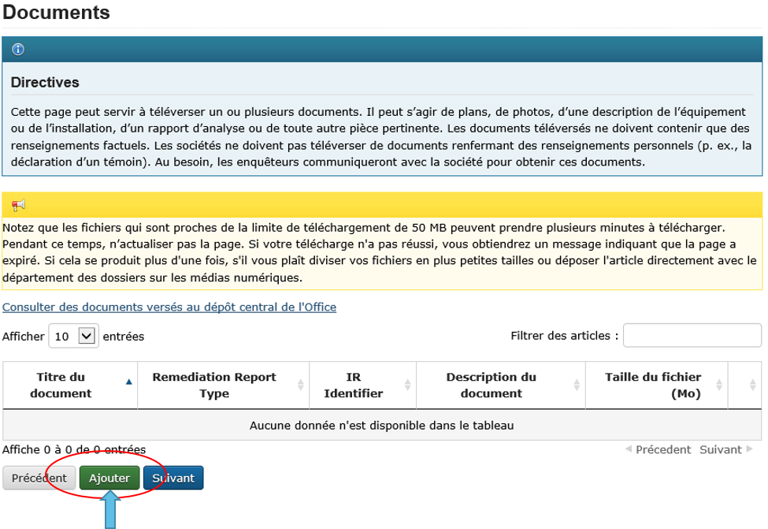
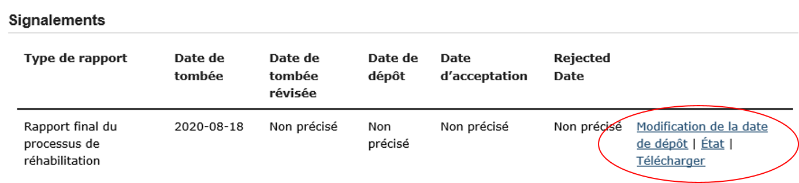

Signaler les événements de réhabilitation
=========================================
1. Introduction
---------------

Le système de signalement d’événement en ligne (« SSEL ») a été créé
pour permettre aux sociétés de signaler les événements directement à la
Régie de l’énergie du Canada. Ce guide renferme des instructions sur la
manière d’utiliser le SSEL pour signaler une contamination au moyen d’un
avis de contamination, soumettre des documents tels qu’un plan de
mesures correctives (« PMC »), un rapport de clôture et un compte rendu
annuel, et communiquer avec l’analyste de l’environnement de la Régie
affecté à l’activité de réhabilitation.

Pour obtenir des renseignements sur les autres types d’événements devant
être signalés et des précisions sur ces types d’événements (p. ex.,
rapport d’incident), veuillez consulter les *Lignes directrices sur les
rapports d’événement*
(https://www.cer-rec.gc.ca/fr/regie/lois-reglements/loi-regie-canadienne-lenergie-reglements-notes-dorientation-documents-connexes/lignes-directrices-rapports-evenement/index.html)
ou le *Guide sur le processus de réhabilitation*
(`https://www.cer-rec.gc.ca/sftnvrnmnt/nvrnmnt/rmdtnprcssgd/index-fra.html#wb-tphp <https://www.rec-cer.gc.ca/sftnvrnmnt/nvrnmnt/rmdtnprcssgd/index-fra.html>`__)
de la Régie de l’énergie du Canada.

2. Contactez-nous
-----------------

Si vous avez des questions techniques relatives à une activité de
réhabilitation en particulier que vous avez déjà signalée dans le SSEL,
veuillez envoyer un courriel à remediation@rec-cer.gc.ca. Votre demande
de renseignements sera transmise à l’analyste de l’environnement de la
Régie affecté à votre activité de réhabilitation.

Ce guide couvre les principales fonctions liées aux activités de
réhabilitation dans le SSEL. Si vous avez de la difficulté à déposer un
avis de contamination ou que vous ne trouvez pas l’information dont vous
avez besoin dans le présent guide, veuillez envoyer un courriel à
remediation@rec-cer.gc.ca. Un membre du personnel de la Régie vous
répondra dans un délai d’un jour ouvrable.

3. Abréviations
---------------

Régie Régie de l’énergie du Canada

RID Rapport d’incident détaillé

DR Demande de renseignements

SSEL Système de signalement d’événement en ligne

PMC Plan de mesures correctives

4. Dépôt d’un avis de contamination
-----------------------------------

4.1 Mode d’emploi
^^^^^^^^^^^^^^^^^

Le SSEL se trouve à l’adresse Web suivante :
https://apps.rec-cer.gc.ca/ERS/Accueil/Index/.

Pour signaler un événement, cliquez sur le bouton Continuer au bas de la
page d’accueil. Vous devez fournir certains renseignements, dont une
adresse électronique. L’adresse électronique permet au système de vous
envoyer un lien menant au portail complet du SSEL. Une fois la page
remplie, cliquez sur Enregistrer et suivant.

|image1|

**Confirmation par courriel**

Un message qui comprend un lien menant au portail du SSEL sera envoyé à
l’adresse électronique que vous avez fournie. Si le message ne se trouve
pas dans votre boîte de réception, vérifiez dans vos autres dossiers,
comme votre dossier de pourriels, au cas où il y aurait été envoyé
automatiquement.

Le lien se trouvant dans la confirmation par courriel vous dirigera vers
le portail du SSEL où vous devrez entrer d’autres renseignements.

4.2 Naviguer dans le SSEL
^^^^^^^^^^^^^^^^^^^^^^^^^

-  Pour accéder à votre événement dans SSEL, utilisez le lien fourni
   dans le courriel.

-  Pour naviguer dans le SSEL, utilisez les boutons « Suivant » et
   « Enregistrer et suivant » au bas de chaque page. Les pages suivent
   une séquence logique pour entrer tous les renseignements nécessaires
   à votre rapport.

-  Le SSEL exige certaines données sans lesquelles il affichera un
   message d’erreur et indiquera ce qui doit être corrigé.

4.3 Signaler des types d’événements en particulier
^^^^^^^^^^^^^^^^^^^^^^^^^^^^^^^^^^^^^^^^^^^^^^^^^^

Le premier écran qui s’affichera vous permettra de sélectionner les
types d’événements que vous souhaitez signaler. Vous trouverez « Avis de
contamination » sous « Avis – Réhabilitation ».

|image2|

**Remarque :** La détermination d’une contamination résiduelle dans un
rapport d’incident détaillé (« RID ») générera automatiquement un lien
vers un dépôt d’avis de contamination. L’avis de contamination doit être
rempli dans les cinq jours suivant la réception du lien. Ce lien est
envoyé à la personne-ressource qui a rempli le RID.

4.4 Société
^^^^^^^^^^^

Sur l’écran suivant, il faut entrer des renseignements au sujet de la
société responsable du pipeline visé par l’avis de contamination.

Lorsque vous avez terminé d’entrer les renseignements sur la société,
cliquez sur le bouton « Enregistrer et suivant » au bas de la page.

|image3|

4.5 Coordonnées
^^^^^^^^^^^^^^^

L’écran des coordonnées affiche les renseignements entrés dans la page
de coordonnées initiale. Des coordonnées supplémentaires peuvent être
entrées dans cet écran en sélectionnant « Add Contact ». Les coordonnées
peuvent être modifiées en cliquant sur « Modifier » à droite des
coordonnées.

|image4|

4.6 Emplacement
^^^^^^^^^^^^^^^

La page de l’emplacement est obligatoire pour tous les événements.
Elle permet aux sociétés de communiquer les détails de l’emplacement à
la Régie.

|image5|

|image6|

***Ce qu’il faut savoir sur la page de l’emplacement***

1. Il faut inscrire un pipeline ou une installation sur la page de
   l’emplacement. Si vous ne trouvez pas les renseignements que vous
   cherchez, vous pouvez sélectionner « Non inscrite » et entrer le nom,
   le diamètre, la longueur et le produit transporté s’il s’agit d’un
   pipeline ou entrer le nom, le type d’installation, la latitude et la
   longitude s’il s’agit d’une installation. Le personnel de la Régie
   effectuera ensuite une comparaison entre les renseignements et ceux
   figurant dans ses bases de données.

|Image7|

2. À la question « Quel est le centre habité le plus près du site
   contaminé? », veuillez uniquement indiquer le nom du hameau, du
   village, de la ville, etc. N’entrez pas la province.

|image8|

3. Les coordonnées GPS sont obligatoires pour les sites contaminés. La
   fonction « Montrer dans Google Maps » ne fonctionne que si vous avez
   entré des coordonnées GPS dans le système.

|image9|

    Si vous avez sélectionné une installation, le système inscrira
    automatiquement les coordonnées GPS à partir des renseignements
    consignés aux dossiers de le Régie. Si vous constatez que ces
    renseignements sont incorrects, veuillez communiquer avec la Régie
    en écrivant à remediation@rec-cer.gc.ca.

4. Utilisez les définitions ci-dessous pour vous aider à choisir la
   catégorie d’utilisation des terrains appropriée.

|image10|

**Terres agricoles**
    Les terres qui sont actuellement cultivées ou qui présentent des
    signes de culture récente (c’est-à-dire au cours des 5 dernières
    années); ou

    Les terres qui n’ont pas été récemment cultivées (c’est-à-dire au
    cours des 5 dernières années), et
    où le gazon a poussé ou commence à pousser et qui sont utilisées
    pour le pâturage des animaux ou à d’autres fins agricoles.

**Zone protégée**
    Les terrains désignés comme protégés, selon la réglementation
    gouvernementale, dont la mise en valeur n’est pas autorisée ou est
    restreinte. Il peut s’agir notamment de parcs nationaux, provinciaux
    et régionaux, de terres fédérales et provinciales protégées (par
    exemple, les réserves fauniques, les réserves écologiques), et
    d’habitats essentiels désignés pour les espèces figurant à
    l’annexe 1 de la *Loi sur les espèces en péril*.

**Terrain non mis en valeur**
    Désigne les terrains qui demeurent dans un état relativement
    naturel. Il peut s’agir notamment de prairies indigènes et de
    terrains forestiers. Si l’utilisation des terrains entre à la fois
    dans les catégories d’aire protégée et de terrains non mis en
    valeur, sélectionnez « Zone protégée ».

**Terrain aménagé – Industriel**
    Désigne les terrains sur lesquels l’activité principale consiste à
    produire, fabriquer ou construire des biens.

**Terrain aménagé – Petits commerces**
    Désigne les terrains sur lesquels l’activité principale est liée à
    des entreprises commerciales et non résidentielles ou
    manufacturières.

**Terrain aménagé – Résidentiel**
    Désigne les terrains sur lesquels l’activité principale est liée à
    des habitations et des activités résidentielles.

4.7 Rapport initial
^^^^^^^^^^^^^^^^^^^

Cette page invite les utilisateurs à entrer des renseignements sur
la contamination. Si une contamination par des tiers est signalée,
indiquez « Contamination par des tiers » dans la description en une
phrase.

|image11|

**Ce qu’il faut savoir sur la page du rapport initial**

1. La description en une phrase du site doit inclure le principal
   contaminant et quelques mots qui décrivent le lieu. Par exemple,
   « Contamination par les hydrocarbures de la station de
   compression XYZ ou, pour une installation, « Contamination par les
   amines à côté du bâtiment des services publics de XX dans la partie
   sud-ouest de la cour clôturée ».

|image12|

2. La date à laquelle la contamination a été constatée est la date à
   laquelle la contamination possible a été constatée. La date à
   laquelle la contamination a été confirmée est la date à laquelle des
   résultats d’analyse de laboratoire confirmant une contamination
   supérieure aux critères applicables ont été reçus par la société, ou
   par un tiers travaillant pour le compte de la société.

|image13|

3. Utilisez les définitions ci-dessous pour vous aider à choisir
   l’activité appropriée.

|image14|

**Construction**
   doit être sélectionné lorsque l’activité de
   réhabilitation s’est produite pendant une phase de construction. Le
   numéro d’instrument de réglementation de la Régie correspondant
   (ordonnance ou certificat) doit être saisi pour les activités de
   construction.

**Exploitation**
   doit être sélectionné lorsque l’activité de
   réhabilitation s’est produite pendant la phase d’exploitation d’un
   pipeline ou d’une installation.

**Entretien**
    doit être sélectionné lorsque l’activité de
    réhabilitation s’est produite pendant la phase d’entretien d’un
    pipeline ou d’une installation. Le numéro d’événement de l’avis
    d’exploitation et d’entretien correspondant doit être entré pour les
    activités d’entretien.

**Cessation d’exploitation**
    doit être sélectionné lorsque l’activité
    de réhabilitation s’est produite pendant la phase de cessation
    d’exploitation d’un pipeline ou d’une installation. Le numéro
    d’instrument de réglementation de la Régie correspondant (ordonnance
    ou certificat) doit être entré pour les activités de cessation
    d’exploitation.

4.8 Scénario
^^^^^^^^^^^^

La page du scénario permet à la société de fournir plus de
renseignements sur la contamination signalée. Par exemple, si la société
déclare un avis de contamination, la page des circonstances lui
permettra de signaler le type de contamination observé. À la page des
circonstances, le système demandera également des renseignements
supplémentaires en fonction de ce que de l’utilisateur a entré.

|image15|

|image16|

**Ce qu’il faut savoir sur la page du scénario**

1. Pour décrire l’étendue de la contamination, décrivez brièvement
   l’ampleur de la contamination à l’endroit touché, comme il a été
   établi au moment du dépôt de l’avis de contamination.

|image17|

2. Définition d’un récepteur – Personne ou organisme (y compris les
   plantes) pouvant être exposés à une substance chimique. Si « Faune
   terrestre » est sélectionné, il n’est pas nécessaire d’indiquer la
   distance minimale entre le récepteur et la contamination.

|image18|

3. Avis aux personnes et communautés susceptibles d’être touchées et
   mobilisation – Les documents ne peuvent pas être téléversés avant le
   dépôt de l’avis de contamination. Lors du dépôt de l’avis de
   contamination, la fonctionnalité permettant de téléverser un document
   apparaîtra dans le menu, du côté gauche de la page. Joindre les
   documents dès le dépôt de l’avis de contamination.

4. Si vous avez des questions ou des préoccupations concernant la
   transmission d’un avis aux groupes autochtones susceptibles d’être
   touchés par la contamination, veuillez en discuter avec l’analyste de
   l’environnement de la Régie affecté à votre activité de
   réhabilitation. Voir le `*Guide de mobilisation
   précoce* <http://www.rec-cer.gc.ca/bts/ctrg/gnnb/rlnggmntgd/index-fra.html>`__
   de la Régie pour plus obtenir de renseignements sur les attentes
   liées à la mobilisation.

4.9 Page des mesures
^^^^^^^^^^^^^^^^^^^^

La page des mesures permet à la société de décrire les mesures prises à
ce jour pour atténuer les effets de la contamination et des activités de
réhabilitation prévues. À la page des mesures, le système demandera
également des renseignements supplémentaires en fonction de ce que de
l’utilisateur a entré.

|image19|

**Ce qu’il faut savoir sur la page des mesures**

1. Les mesures prévues pour atténuer les effets de la contamination
   doivent comprendre une brève description des prochaines étapes.

2. S’il est indiqué que toutes les substances ont été nettoyées de sorte
   que tous les critères applicables ont été respectés, un courriel vous
   sera envoyé pour vous informer qu’un rapport de clôture doit être
   téléversé pour que le dossier du site puisse être fermé, comme il est
   indiqué dans le *Guide sur le processus de réhabilitation*.

3. Si vous répondez « Oui » à la question « La contamination est-elle
   confinée à la propriété de la société », deux autres questions
   apparaissent. Cette question concerne les terrains que loue ou
   possède une société.

|image20|

    Si la société indique que l’installation dispose d’un plan de
    surveillance de l’eau souterraine et de l’eau de surface et qu’aucun
    produit n’a été détecté dans les puits d’eau souterraine, la Régie
    pourrait ne pas exiger d’autres documents que les feuilles de
    travail de classification du Conseil canadien des ministres de
    l’environnement (« CCME ») et les comptes rendus annuels. La Régie
    s’attend à ce que la contamination accessible soit éliminée dans les
    installations, comme le prévoit le programme de protection de
    l’environnement de la société.

4. Veuillez prendre note que les terrains dont la société est
   propriétaire ne comprennent pas l’emprise, à moins que la société
   possède les terrains sur lesquels se trouve l’emprise\ **. Si la
   contamination se limite aux terrains dont la société est propriétaire
   au moment de déposer l’avis de contamination, mais qu’il est
   déterminé par la suite qu’elle a migré hors des terrains appartenant
   à la société, un courriel doit être envoyé à
   remediation@rec-cer.gc.ca pour informer la Régie de la migration hors
   site. De même, si aucun produit n’est détecté dans les puits de
   surveillance de l’eau souterraine au moment du dépôt de l’avis de
   contamination, mais qu’il est détecté ultérieurement, la Régie doit
   en être informée.**

4.10 Évaluation préalable
^^^^^^^^^^^^^^^^^^^^^^^^^

La page de l’évaluation préalable permet à la société de fournir des
renseignements supplémentaires sur la contamination dans les cas où la
contamination n’a pas été nettoyée au moment du dépôt de l’avis de
contamination et où la contamination ne se limite pas aux terrains
appartenant à la société. Les réponses doivent refléter les
renseignements disponibles au moment du dépôt de l’avis de
contamination.

Les réponses aux questions de l’évaluation préalable sont utilisées pour
attribuer automatiquement un statut de « faible risque environnemental »
à certains sites contaminés. Si les réponses aux questions de
l’évaluation préalable indiquent un « risque faible », le SSEL envoie
automatiquement une demande de rapport de clôture. Après examen des
renseignements présentés dans l’avis de contamination, l’analyste de
l’environnement de la Régie peut déterminer que des renseignements
supplémentaires sont nécessaires avant la présentation d’un rapport de
clôture. Dans ce cas, l’analyste de l’environnement de la Régie demande
des renseignements supplémentaires par l’intermédiaire du SSEL.

Pour les activités de réhabilitation sur un site dont le statut va
de risque modéré à élevé, l’activité est effectuée selon la procédure
normale présentée à la section 5.0 du présent document.

|image21|

4.11 Notes de la société
^^^^^^^^^^^^^^^^^^^^^^^^

Cet écran permet aux utilisateurs de soumettre et de joindre un
commentaire à l’avis de contamination. Cette boîte de commentaires
permet de faire part de commentaires, de questions et de préoccupations
supplémentaires au membre du personnel de la Régie chargé de l’avis de
contamination. Le nom et l’adresse électronique de l’auteur des
commentaires sont obligatoires.

|image22|

4.12 Signalement final
^^^^^^^^^^^^^^^^^^^^^^

| Dès que vous avez cliqué sur le bouton « Transmettre » au bas de la
  page, un membre du personnel de la Régie sera avisé et examinera les
  renseignements fournis pour vérifier leur exhaustivité. Il vous
  enverra un courriel pour vous informer de la prochaine mesure à
  prendre ou pour obtenir plus de détails, s’il y a lieu. Le système
  attribue automatiquement à l’événement un numéro REM, qui est utilisé
  comme numéro de référence.
| Veuillez prendre note que le lien vers les données fournies
  relativement à l’activité de réhabilitation sera désactivé et que vous
  ne pourrez plus modifier les renseignements après avoir cliqué sur le
  bouton « Transmettre ».

**Ce qu’il faut savoir sur la page du signalement final**

1. Les étapes suivantes de la gestion du site contaminé peuvent varier
   en fonction des réponses données aux questions posées lors du dépôt
   de l’avis de contamination. Certains sites peuvent ne nécessiter
   aucune autre mesure que le compte rendu annuel, tandis que d’autres
   peuvent nécessiter une gestion plus approfondie. D’autres sites
   peuvent nécessiter le dépôt d’un rapport de clôture immédiatement
   après le dépôt de l’avis de contamination final.

2. Après avoir envoyé le signalement final, vous recevez par courriel un
   avis de confirmation de votre envoi avec le contenu de votre rapport.
   Le courriel précisera la prochaine mesure requise selon le *Guide sur
   le processus de réhabilitation*.

3. Vous ne pourrez plus, à ce moment-là, utiliser le lien fourni pour
   modifier les données présentées dans l’avis de contamination. Le lien
   sera désormais utilisé pour gérer l’activité de réhabilitation et ne
   pourra être utilisé que pour les changements de coordonnées, les
   téléversements de documents, les demandes de renseignements (« DR »),
   les notes de la société et les prolongations des délais d’envoi. Si
   vous avez omis de présenter des renseignements pertinents ou que vous
   avez cliqué sur « Transmettre » par erreur, veuillez communiquer avec
   la Régie en écrivant à remediation@rec-cer.gc.ca.

La section suivante contient des renseignements supplémentaires sur le
suivi des avis de contamination.

5. Gestion des activités de réhabilitation
------------------------------------------

Après examen de l’activité de réhabilitation, l’analyste de
l’environnement de la Régie enverra un courriel décrivant le prochain
envoi requis relativement à cette activité. Ce message comprendra un
lien qui pourra être utilisé pour les communications futures (réponses
aux DR) et pour le téléversement de documents. Utilisez le lien dans le
courriel pour accéder au portail en ligne afin de téléverser le rapport.

En entrant de nouveau dans le SSEL après le dépôt de l’avis de
contamination, le menu de gauche comprendra la table des matières
suivante.

|image23|

5.1 Résumé
^^^^^^^^^^

Cette page donne un aperçu des renseignements entrés dans l’avis de
contamination. Les renseignements figurant sur cette page ne peuvent
être modifiés que par le personnel de la Régie.

5.2 Coordonnées
^^^^^^^^^^^^^^^

L’écran des coordonnées affiche les renseignements entrés dans la page
de coordonnées initiale. Des coordonnées supplémentaires peuvent être
entrées dans cet écran en sélectionnant « Add Contact ». Les coordonnées
peuvent être modifiées en cliquant sur « Modifier » à droite des
coordonnées.

|image4|

Veillez à ce que les renseignements qui s’y trouvent soient à jour et
exacts. Veillez à mettre à jour ce champ lorsque les coordonnées de la
société sont modifiées. Il faut inscrire les coordonnées d’au moins une
personne pour chaque activité de réhabilitation. S’il y a les
coordonnées de plusieurs personnes sur cette page, chacune d’elles
recevra des avis pour cette activité de réhabilitation.

5.3 Rapports de réhabilitation
^^^^^^^^^^^^^^^^^^^^^^^^^^^^^^

Cette page présente les rapports exigés par la Régie relativement à
cette activité de réhabilitation, selon le *Guide sur le processus de
réhabilitation*. Pour accéder à la liste des rapports de réhabilitation
requis, sélectionnez « Rapports de réhabilitation ».

|image24|

Le lien « Téléversement » à côté du rapport souhaité doit être utilisé
pour téléverser les documents requis avant la date de dépôt indiquée.
Lors du téléversement d’un document, l’analyste de l’environnement de la
Régie est avisé qu’il doit procéder à l’examen et assurer le suivi
nécessaire. Les documents peuvent également être téléversés à la page
« Téléversement de document ». Pour accéder aux détails, aux documents
et aux demandes de renseignements relatifs à un rapport en particulier,
sélectionnez « État » à côté du rapport souhaité.

|image25|

5.4 Rapports de réhabilitation – État et détails
^^^^^^^^^^^^^^^^^^^^^^^^^^^^^^^^^^^^^^^^^^^^^^^^

Vous trouverez ci-dessous un exemple de la page « État et détails »
relativement à un PMC, un type de rapport de réhabilitation. Les détails
concernant le rapport, les documents joints et la demande de
renseignements, y compris la réponse à la DR, et les examens se trouvent
sur cette page.

|image26|

**Remarque:** Le processus d’acceptation des PMC n’est pas la même que
pour les autres types de rapports. Lorsqu’un PMC est accepté, la ou les
personne(s)-ressource(s) de la société désignées reçoivent un courriel
renfermant les commentaires du personnel de la Régie. Pour les autres
types de rapports, les commentaires du personnel de la Régie sont
affichés sur la page ci-dessus.

Une liste de documents est jointe à chaque type de rapport sur la page
État. Figurent également sur cette page les détails des demandes de
renseignements pour chaque type de rapport. La capture d’écran
ci-dessous donne un aperçu de la page État et détails pour un type de
rapport particulier.

|image27|

5.5 Rapports – Changement de la date de dépôt
^^^^^^^^^^^^^^^^^^^^^^^^^^^^^^^^^^^^^^^^^^^^^

En sélectionnant « Rapports » sous « Rapports de réhabilitation », vous
pourrez voir les types de rapports requis pour l’activité de
réhabilitation. En cliquant sur un rapport en particulier, vous
accéderez à une page qui peut être utilisée pour modifier la date de
dépôt du document et inscrire une justification du changement de date.
Vous pourrez également sélectionner « Modification de la date de dépôt »
à côté du nom du rapport sur la page des rapports de réhabilitation pour
accéder à la même page. Si vous souhaitez voir les détails, les
documents et les demandes de renseignements relatifs à un rapport en
particulier ou téléverser un document, sélectionnez « Rapports de
réhabilitation », puis « État » ou « Télécharger » à côté du nom du
rapport souhaité.

|image28|

Pour présenter une demande de modification de la date de dépôt, entrez
la date proposée et une justification, puis cliquez sur « Transmettre ».
Un courriel sera alors envoyé au personnel de la Régie affecté à
l’activité de réhabilitation. La ou les personne(s)-ressource(s) de la
société recevront un courriel lorsque le personnel de la Régie acceptera
ou rejettera la demande de modification de la date limite de dépôt.

|image29|

5.6 Demande de renseignements
^^^^^^^^^^^^^^^^^^^^^^^^^^^^^

Le personnel de la Régie affecté à votre activité de réhabilitation peut
produire une demande de renseignements pour mieux comprendre, clarifier
et obtenir des renseignements sur un rapport qui a été téléversé. Le
système vous informera par courriel si des renseignements
supplémentaires sont demandés. Toutes les réponses aux demandes de
renseignements doivent être entrées dans le système. L’état de la
demande de renseignements se trouve sur cette page. Les demandes de
renseignements peuvent également être consultées à partir de la page
« État » dans les rapports de réhabilitation. Pour fournir une réponse à
une DR, sélectionnez « Demandes de renseignements » dans le menu à
onglets, puis « Modifier la réponse » à côté de la DR à laquelle vous
souhaitez répondre.

|image30|

Le lien « Modifier la réponse » vous mène à la page ci-dessous où vous
transmettrez la réponse à la DR de l’analyste de l’environnement.
Veuillez entrer la réponse et l’adresse électronique dans la boîte de
texte ci‑dessous et cliquer sur le bouton « Transmettre ». Une fois
envoyée, la réponse ne peut plus être modifiée.

Si la réponse à la demande de renseignements comprend un document,
téléversez le document à partir de la page « Téléversement de document »
et sélectionnez le type de rapport de réhabilitation et la DR visés par
cette réponse.

|image31|

Une fois qu’un analyste de l’environnement de la Régie aura examiné la
DR, il pourra formuler des commentaires dans son examen. Aucun courriel
renfermant les commentaires du personnel de la Régie ne sera envoyé,
mais ces commentaires seront visibles sous l’onglet « Demande de
renseignements » ou à la page « État » de l’onglet « Rapports de
réhabilitation ». Le personnel de la Régie peut informer la société de
l’acceptation de la réponse à la DR. Une DR supplémentaire peut être
produite si les conditions de la DR initiale n’ont pas été remplies.

5.7 Comptes rendus annuels
^^^^^^^^^^^^^^^^^^^^^^^^^^

Les comptes rendus annuels précédents relatifs à l’activité de
réhabilitation figurent sur cette page. Aucun renseignement apparaissant
dans les comptes rendus annuels passés ne peut être modifié.

Une demande de compte rendu annuel sera envoyée par courriel par la
Régie le 1\ :sup:`er` avril. Ce courriel contiendra un lien menant à la
page qui répertorie toutes les activités de réhabilitation actives
(c’est-à-dire non closes ou incomplètes) de la société pour laquelle
vous agissez en tant que personne-ressource (c’est-à-dire que si votre
société a affecté plus d’une personne-ressource à différentes activités
de réhabilitation, chacune de ces personnes recevra la même liste de
comptes rendus annuels). Un compte rendu annuel doit être envoyé pour
chaque activité de réhabilitation à l’égard de laquelle un avis de
contamination a été déposé avant le 31 décembre de l’année précédente et
qui n’est pas encore clos.

Vous pourrez envoyer le compte rendu annuel dès réception du courriel de
demande de compte rendu annuel envoyé par la Régie. Les comptes rendus
annuels doivent être envoyés au plus tard le 30 juin. Des courriels de
rappel seront envoyés le 15 juin.

Voici un exemple de compte rendu annuel. Il faut répondre à ces
quatre questions pour chaque activité de réhabilitation. Sélectionnez
« Enregistrer » lorsque vous souhaitez conserver l’état d’avancement du
compte rendu annuel. Sélectionnez « Transmettre » lorsque vous êtes prêt
à envoyer le compte rendu annuel à la Régie. Le compte rendu annuel ne
peut pas être modifié une fois qu’il a été envoyé.

|image32|

**Ce qu’il faut savoir sur les comptes rendus annuels**

1. Le statut du site doit être mis à jour chaque année. Les conseils
   ci-dessous doivent être utilisés pour attribuer un statut aux sites
   visés par une activité de réhabilitation :

|image33|

   Évaluation du site : évaluation environnementale du site en cours
   pour déterminer les étapes suivantes, avant les mesures correctives
   ou la gestion des risques.

   Mesures correctives en cours : le PMC a été déposé et des mesures
   correctives sont en cours.

   Mesures correctives après la surveillance de l’assainissement : les
   mesures correctives actives sont terminées et la surveillance de
   l’eau souterraine ou de la remise en état est en place.

   Gestion du risque : le plan de gestion du risque a été déposé et la
   gestion du risque est en cours.

   Surveillance des installations : utilisez ce statut pour les
   installations situées sur des terrains appartenant à la société ou
   loués par elle, où un programme de surveillance de l’eau souterraine
   est en place, comme il est décrit dans la section 12.3 du *Guide sur
   le processus de réhabilitation* 2020 de la Régie.

2. Les éléments qui doivent être inclus dans le résumé des futures
   activités de réhabilitation prévues et dans les rapports déposés sont
   les suivants : les plans d’élaboration d’un plan de mesures
   correctives (« PMC »), d’un plan de gestion des risques ou d’un
   rapport de clôture dans le compte rendu annuel), ainsi que la
   justification du rapport en cours d’élaboration. L’analyste de
   l’environnement de la Régie prend en compte cette justification,
   ainsi que les renseignements figurant dans l’avis de contamination,
   les feuilles de travail de classification du CCME et l’intérêt de
   toute personne à l’égard du site, lorsqu’il demande un PMC, un plan
   de gestion des risques ou un rapport de clôture. Reportez-vous à
   l’annexe C du *Guide sur le processus de réhabilitation* 2020 de la
   Régie pour savoir quand un PMC est nécessaire.

5.8 Notes de la société
^^^^^^^^^^^^^^^^^^^^^^^

Cet écran permet aux utilisateurs de soumettre des commentaires
relativement à l’activité de réhabilitation. Cette boîte permet de faire
part de commentaires, de questions et de préoccupations supplémentaires
au membre du personnel de la Régie chargé de l’avis de contamination. Le
nom et l’adresse électronique de l’auteur des commentaires sont
obligatoires. Sélectionnez « Transmettre » lorsque vous serez prêt à
envoyer vos commentaires à la Régie. Sélectionnez « Enregistrer » si
vous souhaitez enregistrer votre progression, mais que vous n’êtes pas
prêt à envoyer le message. Remarque : le personnel de la Régie peut
toujours consulter les notes de la société lorsqu’elles sont
« enregistrées », mais il ne recevra pas d’avis par courriel tant que
les notes n’auront pas été « transmises ».

|image22|

5.9 Page des documents
^^^^^^^^^^^^^^^^^^^^^^

L’écran « Documents » permet de téléverser des documents relatifs à
l’activité de réhabilitation (photos, rapports, lettres, etc.).

Remplissez les champs obligatoires et sélectionnez le type de document à
partir du menu déroulant.

Vous pouvez sélectionner « Ajouter » pour chaque document supplémentaire
et cliquer sur « Suivant » lorsque tous les documents ont été
téléversés.

**Ce qu’il faut savoir sur la page des documents**

1. La taille limite des téléversements est de 50 Mo. Si vous avez un
fichier plus volumineux, vous pouvez le faire parvenir en format papier
ou sur support numérique directement au service des dossiers et du
courrier de la Régie. Dans ce cas, veuillez indiquer le numéro de
l’activité de réhabilitation.

2. Vous pouvez téléverser autant de documents que nécessaire.

3. Si vous avez téléversé un document et que vous souhaitez le
supprimer, vous pouvez communiquer avec la Régie par courriel à
remediation@rec-cer.gc.ca

4. Ne téléversez pas de documents qui contiennent des renseignements
privés ou de nature sensible. Vous devez les déposer en format papier au
service des dossiers et du courrier de la Régie et indiquer que vous
souhaitez les présenter aux termes de l’article 16.1 de la *Loi sur la
Régie canadienne de l’énergie*. Comme il a été mentionné ci-dessus,
veuillez indiquer le numéro de l’activité de réhabilitation sur le
document.

|image34|

5.10 Fermeture du site
^^^^^^^^^^^^^^^^^^^^^^

La fermeture d’un site est entamée par le personnel de la Régie, qui
demandera un « rapport de clôture » au moyen d’un courriel généré par le
système. Le déroulement des opérations pour cette demande est similaire
à celui lié aux autres types de rapports. La personne-ressource de la
société peut demander une prolongation du délai, consulter l’état du
rapport et téléverser un document relatif au rapport de clôture sous
l’onglet « Rapports de réhabilitation ».

|image35|

Lorsqu’un rapport de clôture et une lettre de déclaration sont déposés,
l’analyste de l’environnement de la Régie examine le rapport de clôture
et, s’il est satisfait, recommande la fermeture du dossier du site au
directeur de l’équipe de protection de l’environnement. Après avoir
accepté la recommandation, la Régie envoie par courriel une lettre
signifiant la fin du processus de réhabilitation et ferme le dossier de
l’activité de réhabilitation dans le SSEL. La société reçoit un courriel
automatique indiquant que le dossier de l’activité de réhabilitation a
été fermé et qu’elle ne pourra plus y accéder dans le SSEL.

.. |image21| image:: media/image21.png

.. |image25| image:: media/image25.png

